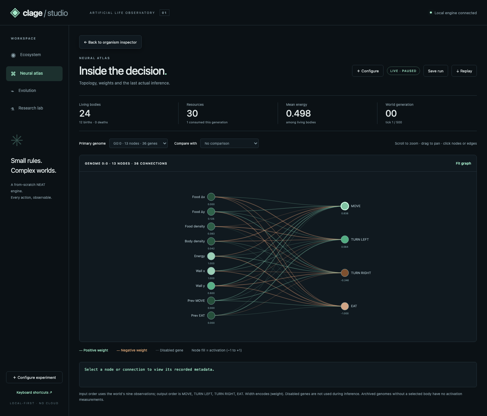
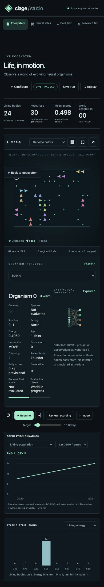

# Clage Studio 1.0 — final release review

Review date: **2026-10-08 UTC**. Scope: stabilization of the existing local-first
Studio release candidate, not the remaining platform roadmap.

## 1. Preservation and review method

- Starting branch: `studio/clage-1.0`, clean before changes.
- Starting HEAD: `cb7e913c25956807d4a214a4215e40fa1c72e44d`.
- Local safety tag: `backup/studio-pre-final-review-2026-10-08`, pointing to that HEAD.
- Final production-code HEAD: `812409937d2e9c5f5ced9200bb22b6c06c19f6a3`.
  Subsequent report/evidence commits do not change production source. The final
  delivery HEAD is available with `git rev-parse HEAD` and in the delivery response.
- Inspected the actual ES-module/Canvas/SVG frontend, all navigation handlers,
  orchestration, strict replay contracts and reconciled engine invariants.
  Retained this architecture; added no dependencies or replacement NEAT engine.
- Used actual headless Chromium UI interactions, Playwright screenshots, keyboard
  workflows and a separate final smoke script. This is not a native GUI,
  physical-phone, Firefox or Safari certification.
- Ran browser suites in isolated detached worktrees because existing browser
  tests deliberately write `docs/studio` screenshots and benchmark results.
  Ran scientific/build checks against a clean detached production-code checkout,
  writing their output outside that checkout. This prevents overwriting the
  historical benchmarks and preserves trustworthy commit/dirty provenance.
- The previously recovered Work reports and semantic reconciliation remain
  intact. No unavailable Work bundle, ZIP or original commit lineage was recovered
  or reconstructed during this review.

Evidence root: `docs/final-review/2026-10-08/`. Earlier measurements from this
review are retained under its `initial-verification-*` directories; they are
not substituted for the final-source results in the root directory.
Trailing whitespace in generated text evidence is normalized for Git hygiene;
measurements, conclusions and historical artifact bytes are not changed.

## 2. Back navigation

The original application only assigned a view variable. Cross-view inspection
had no return stack or browser history, and the brand link reloaded the document.

Implemented contextual **← Back** in the leading main-view header, sticky during
long/mobile inspection so it remains visible without scrolling back to the top.
Configuration/help dialogs have labeled Back controls in their headers rather
than unexplained × controls. Existing replay exit now reads **← Back to live**.
Top-level workspace screens intentionally do not acquire redundant Back buttons.

| Flow | Return behavior |
| --- | --- |
| World → organism inspection | Return to the previous organism or unselected ecosystem. The selector also genuinely clears selection without resetting the world. |
| Organism → expanded neural atlas | Return to the organism inspector with body selection, camera, follow setting and recent trail preserved. |
| Neural node/connection metadata | Return one inspection level to the network; repeated metadata selections do not grow a redundant history stack. |
| Evolution → generation champion network | Return to Evolution with the previous ancestry focus restored. |
| Generation history → ancestry → parent genotype | Return through the actual previous ancestry focus, not an arbitrary homepage. |
| Within-world ancestor/child links | Return to the previously inspected body. These remain separate from evolutionary genotype ancestry. |
| Configuration/help | Visible Back, native Escape and browser Back close the dialog; Forward restores it, including an unsubmitted form. |
| Replay → live | Restore the valid live selection/camera/follow context and actual engine speed; remove comparison UI. |
| Comparison | Existing Remove comparison / No comparison controls exit this inline mode; it is not a separate routed page. |
| Brand/top-level workspace buttons | Navigate without reloading or restarting the simulation; repeated clicks on the current root view add no history entry. |

The same-document History API supports browser Back/Forward for views, nested
inspections and dialogs. Navigation preserves the active live/replay session;
browser history is not a replay timeline or an engine checkpoint. Replay frame
seeking and returning to live retain their explicit transport controls.

History stores small presentation snapshots, **not world/genome/replay copies**.
Run identity, replay identity and world generation guard against resurrecting
stale body IDs after a new run or generation. Inference details are cleared when
their primary context changes. Continuous snapshot writes are deduplicated and
throttled; user navigation/selection changes are saved immediately. Popstate
never pushes another entry. Hash URLs reopen root views after reload; ephemeral
inspection/dialog state is intentionally not restored across a document reload.

Cross-view navigation opens the destination at its heading. Back restores the
source scroll position and focus where its control still exists. Escape returns
one nested level outside forms/dialogs. Buttons, neural nodes/connections and
ancestry nodes support keyboard activation without accidentally toggling playback.

Implementation: `studio/static/app.js:1` (navigation/presentation helpers,
inspector handlers and keyboard dispatch), `studio/static/style.css:1` (shared
Back styling, sticky positioning and responsive layouts).

## 3. Functional and visual defects fixed

1. **No nested return path / document reload through the brand.** Added the
   contextual stack, browser history and same-document brand navigation.
2. **Back could be offscreen on a long mobile inspector.** Made the main Back
   sticky, opened cross-view destinations at the top and restored source scroll.
3. **Neural hash reload could stop startup.** With no body or genome yet, both
   IDs were undefined and the old conditional dereferenced `body.inference`.
   Added an explicit body guard; direct neural reload now connects and renders.
4. **Mouse-only inspection and disappearing graph focus.** Added a keyboard
   organism selector, focusable labeled SVG controls, Enter/Space activation,
   focus restoration across actual inference refreshes and Escape handling.
5. **Empty organism selection did nothing.** It now clears selection/follow/trail
   without changing the simulation tick or resetting its configuration.
6. **Stale detail metadata.** Changing primary/comparison genome clears the old
   neural detail, new runs clear inference detail, and unavailable ancestry
   replaces prior provenance text with an explicit unavailable message.
7. **Replay/live presentation drift.** Returning live restores a still-valid
   body context and resets the speed control to the backend's real requested
   ticks/s, not the replay frames/s value. Initial/live state updates also keep
   the control synchronized with backend speed when it is not being edited.
8. **Comparison legend/controls survived returning live or starting a new run.**
   Clear them together with the actual comparison state.
9. **Mobile world canvas occupied only half its panel.** Reproduced a 360×182
   canvas in a 360×360 viewport. Its percentage height had resolved through an
   indefinite flex/intrinsic sizing path. Absolutely fill the relative viewport;
   the canvas and panel now match on desktop, 390px and 320px layouts.
10. **Narrow controls and graph readability.** Wrap headings, world toolbars
    and footer telemetry; keep neural graphs at a legible width inside their own
    horizontal scroller, with a swipe hint. Horizontal/Shift-wheel scrolling is
    not intercepted as a zoom gesture. Keyboard output-node inspection works.

Kept the established dark palette, scientific hierarchy, Canvas ecosystem,
species/energy layers, charts and SVG topology. This is targeted stabilization,
not a full visual redesign. Loading/empty states, complete/disabled transport,
configuration errors, malformed imports, zero-food/extinct worlds and a
1,000-body world were exercised by the retained/new browser workflows.

## 4. Scientific correctness findings

Two **reproducible recording-validation defects** were discovered and fixed:

- A copied valid replay with an altered frame generation/tick or shifted sequence
  could pass validation despite an impossible timeline. Validate the actual
  fixed-budget contract `sequence = generation * (ticks + 1) + tick`, including
  generation-start frames. Sparse/bounded recordings remain supported.
- A valid replay with best/mean history scores changed by +100 could pass
  validation and display contradictory charts/table summaries. Require best
  and mean to agree with the recorded evaluated founder score list, using
  numerical tolerance rather than inventing new fitness semantics.

Evidence: `studio/core.py:266` (`validate_replay`),
`tests/test_studio.py:1` (`test_replay_rejects_contradictory_timeline_and_fitness_summaries`),
and the real-browser contradictory-import workflow in
`tests/browser/navigation.spec.js:1`. Invalid imports receive HTTP 422, display
the reason and do not replace the live run. These checks establish internal
consistency, not file authenticity or proof of an entire trajectory; deterministic
rerunning from the frozen config/seed is the separate stronger verification.

The reconciled NEAT/world scientific definitions and operators were **not
changed** in this review:

| Area reviewed | Current evidence / conclusion |
| --- | --- |
| Champion identity, first-generation archive and preservation | `neat/population.py:65`; champion/genotype/archive regression cases in `tests/test_semantic_reconciliation.py:1`. Preserve nodes, biases, historical markers, weights and enabled state, not topology alone. |
| Innovation, mutation, crossover and population/species budgets | `neat/innovation.py:1`, `neat/mutation.py:1`, `neat/crossover.py:1`; atomic-history, shared-bias inheritance, elitism and reproduction regressions remain passing. |
| Fitness | Still max descendant-body score per founder genotype: `3*food + .01*age + .5*offspring`. Provisional body scores and evaluated genome/history scores are distinct. Higher scores are not proof of learned foraging. |
| Actual neural observations/activations | Instrumented/uninstrumented inference and independently constructed world-loop/RNG tests in `tests/test_studio.py:1`; inference ticks and pre-/post-action distinction remain explicit. No cosmetic activation simulation was added. |
| Statistics and lineage | Population, energy, actions, food, births/deaths and inference are checked against recorded contents. Body splits and evolutionary genotype parents remain distinct; ancestry boxes are not claims of cooperation. |
| Reproducibility | Frozen configuration/seed, resolved scientific settings, source fingerprint and commit remain recorded. Full-default deterministic rerun and fresh-wheel rerun pass. Replay is not resumable checkpointing. |
| Generalizable learning | **Unproven.** Held-out results remain descriptive per-seed outcomes with sample SD; the foraging heuristic is explicitly privileged by facing information absent from neural inputs. |

Unchanged-budget engine checks: OR **5/5**, AND **5/5**, XOR **5/5**, sine **0/5**
for seeds 0–4 with the existing defaults and 300-generation limit. XOR generations
to solve remain 212, 125, 68, 143 and 102. Sine's mean best training fitness is
0.9195, not a successful fit or held-out learning result. No parameters were tuned
to reproduce unavailable historical Work evidence or to conceal the sine failure.

## 5. Final verification

Environment: macOS ARM64, Python 3.13.6, Node 24.11.1, Playwright 1.63.0,
headless Chromium 153.0.8010.12. Production source is the commit recorded above;
scientific result JSON includes its exact source SHA-256 and clean-checkout flag.
Final source SHA-256:
`8eeec68025bae4e957e53f2bafe024010adb91b50676a306834e91be5731d060`.
The fresh installed wheel reports the same production-source fingerprint.

| Check | Final result | Evidence under the evidence root |
| --- | --- | --- |
| Python | **428 passed** | `python.txt` |
| JavaScript unit tests | **4 passed** | `javascript.txt` |
| Playwright | **21 passed**, no skipped/flaky/unexpected tests | `playwright.txt`, `browser-results.json` |
| Ruff | All checks passed | `ruff.txt` |
| mypy | No issues in 49 production source files | `mypy.txt` |
| Wheel/build/install | `clage-0.4.1` built and installed into a fresh target directory | `wheel.txt` |
| Installed-package smoke | Six bundled configs, four Studio assets, static/OpenAPI/run/step/JSON/gzip and legacy PNG exports verified; 18/18 frames reproduced | `installed-smoke.txt` |
| Full-default run/replay | Eight generations, 2,560 world ticks; 42/42 retained frames reproduced through sequence 2,567 | `deterministic-replay.json` |
| NEAT checks | OR/AND/XOR 5/5, sine 0/5 at unchanged budgets | `neat-benchmarks.md`, `neat-benchmarks.txt` |
| Independent final browser smoke | Live controls, body lineage, network/connection/genome comparison, champion/history, held-out evaluation, replay/comparison, six nonempty exports, mobile scroll and reset/step; zero page errors | `final-browser-smoke.json`, `final-browser-smoke.txt`, `final-smoke.mjs` |

Added five Python regression cases, including API rejection without changing the
live run, and **14 new browser workflows**. Retained all existing Python, JS and
seven browser workflows. Earlier QA failures were not hidden: the initial neural
reload failure and mobile canvas size failure are retained in
`navigation-regression-before.txt` and `mobile-canvas-regression-before.txt`.
An initial navigation assertion also raced the asynchronous step response; it
was corrected to await the tick before taking the comparison snapshot.

Commands used (substitute a writable evidence directory as `E`):

```sh
python3 -m pytest
node --test tests/studio-math.test.js
npx playwright test
python3 -m ruff check .
python3 -m mypy neat world diversity experiments benchmarks visual studio
python3 -m studio.validate --out "$E/deterministic-replay.json"
python3 -m studio.benchmark --out "$E/backend-benchmark.json" --repeats 3
python3 -m benchmarks.run --problems or,and,xor,sin --trials 5 --generations 300 --seed-base 0 --no-plot --report "$E/neat-benchmarks.md"
python3 -m pip wheel --no-deps --no-build-isolation . -w /private/tmp/clage-final-wheel-20261008
python3 -m pip install --no-deps --target /private/tmp/clage-final-installed-20261008-v5 /private/tmp/clage-final-wheel-20261008/clage-0.4.1-py3-none-any.whl
# From outside the checkout, with only the fresh target on PYTHONPATH:
PYTHONPATH=/private/tmp/clage-final-installed-20261008-v5 python3 /Users/utkarsh/Clage/docs/reconciliation/semantic-2026-10-07/installed_smoke.py /private/tmp/clage-final-installed-20261008-v5
# With a disposable, separately launched Studio server, never a user's active run:
node docs/final-review/2026-10-08/final-smoke.mjs http://127.0.0.1:8880
```

Install smoke reuses this machine's already available dependencies; it is not a
fresh operating-system or dependency-matrix certification. There is no separate
frontend build pipeline: the production ES modules, CSS and HTML ship in the wheel.
Run the release with `python3 -m studio` after installing `.[studio]` as described
in the existing quick start. Restart any older Studio Python process when
upgrading: navigation preserves a running simulation, but source changes do not
hot-patch an already imported Python engine. The user's existing server on 8765
was not reset or terminated; QA used separate disposable server ports.

## 6. Performance, screenshots and limitations

The existing benchmark scripts, seed/budget/workload definitions and historical
performance report were preserved. New backend measurements use three repeats
of the existing 30-tick, reproduction-disabled 72/512/1,000-founder workloads,
with and without recording. New browser measurements use the existing paused
72/512/1,000/2,000-body 96×96, 900-food, fit-camera, genome-layer workloads at
1440×1100 and 120 RAF intervals per workload. They are recorded in
`backend-benchmark.json` and `browser-benchmark.json`, not in the historical files.
No speedup or broadly applicable scalability claim follows from timing noise.

| Founders | Backend ticks/s, recording off | Backend ticks/s, recording on |
| --- | ---: | ---: |
| 72 | 1,359.2 | 811.4 |
| 512 | 181.5 | 113.1 |
| 1,000 | 83.6 | 53.4 |

| Paused rendered bodies | Measured RAF FPS | Mean draw CPU ms |
| --- | ---: | ---: |
| 72 | 60.0 | 0.267 |
| 512 | 60.0 | 0.516 |
| 1,000 | 60.0 | 0.848 |
| 2,000 | 60.0 | 1.516 |

The full-default validation retains 42 frames after evicting 2,526 within the
16 MiB recording budget; 16,491,006 JSON bytes are retained. Its measured duration
and process peak RSS are in `deterministic-replay.json`. RSS includes the
interpreter and both runs; this is not a memory-leak proof or hours-long soak test.
The final measurement was **11.208 seconds** for initial execution and
**177.45 MiB** process peak RSS across execution plus rerun.
The background browser workflow also completes a 450-tick/three-generation run
while switching views. Safety budgets remain in place rather than being removed
to claim unlimited populations.

Historical hashes are recorded in `historical-artifact-sha256.txt` and match the
pre-review values for `docs/studio/backend-before.json`, `backend-after.json`,
`browser-benchmark.json`, `long-run-validation.json` and
`CLAGE_STUDIO_PERFORMANCE_REPORT.md`. Their figures and original screenshots
were not overwritten in the release checkout.

Final screenshots include:

- `ecosystem.png`, `ecosystem-back.png`, `neural-back.png`, `evolution.png`,
  `research.png`, `laboratory.png`, `large-population.png`, `empty-world.png`.
- `mobile-ecosystem.png`, `mobile-neural-back.png`, `mobile-evolution.png`,
  `mobile-research.png`, `mobile-replay-comparison.png`, `configuration-error.png`
  and `tablet.png`.
- Separate `smoke-*.png` captures include connection metadata, actual body
  lineage, side-by-side genomes and desktop/mobile replay comparison.

Representative final views:




Remaining limitations:

- This review tested headless Chromium on one machine, with 1440px/1024px/390px
  workflows and a 320px canvas/layout regression. No physical touch device,
  screen-reader audit, Firefox/Safari or multi-OS run was performed.
- State-preserving navigation is session-local. Reload restores a root hash
  view, not browser-session checkpoints, old body identities or discarded replays.
- Replay stores bounded observations, not complete resumable engine/RNG state.
  Graphs describe the received/recorded window, not unsampled engine ticks.
- Huge configurations can hit documented body/recording safety budgets. Paused
  renderer FPS does not certify live 2,000-body inference throughput, all layers
  or hours-long browser memory stability.
- Sine remains unsolved for these seeds/budgets. Generalization, intelligence,
  cooperation and superiority over controls have not been established.
- The existing reconciliation report's broader library/research limitations
  remain; this review does not pretend to complete the deferred roadmap.

## 7. Focused commits and readiness

- `4d1ddb9` — state-preserving contextual history and accessible inspection.
- `212e78d` — configured-run comparison cleanup regression.
- `cb90ede` — correct mobile canvas sizing and narrow control wrapping.
- `7242705` — preserve horizontal scrolling in narrow neural graphs.
- `124d278` — visible sticky Back and source scroll restoration.
- `b3f4c49` — reject contradictory replay timeline/fitness summaries.
- `8124099` — clear organism selection without resetting the world.
- The final documentation/evidence commit adds this report and the measured QA
  artifacts. Its SHA and observed push outcome are reported at delivery.

**Assessment: ready for a normal reviewed PR/merge of the Studio release branch
within its documented local-first simulation/research-exploration scope.** No
reproducible release blocker remains in the exercised workflows. This is not a
claim that all research objectives, browsers or unbounded workloads are solved.

Publication is the separately authorized final step, after checking branch,
committed scope, secrets and cleanliness: `git push -u origin studio/clage-1.0`.
No force push, merge to main, branch deletion or history rewrite is part of this
review. Remote CI is not claimed to have passed merely because local checks pass.
