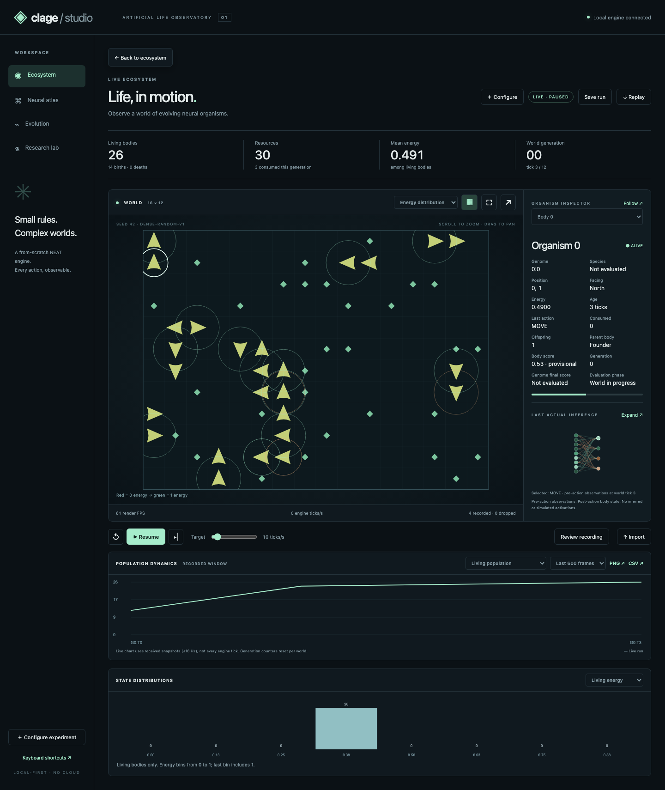
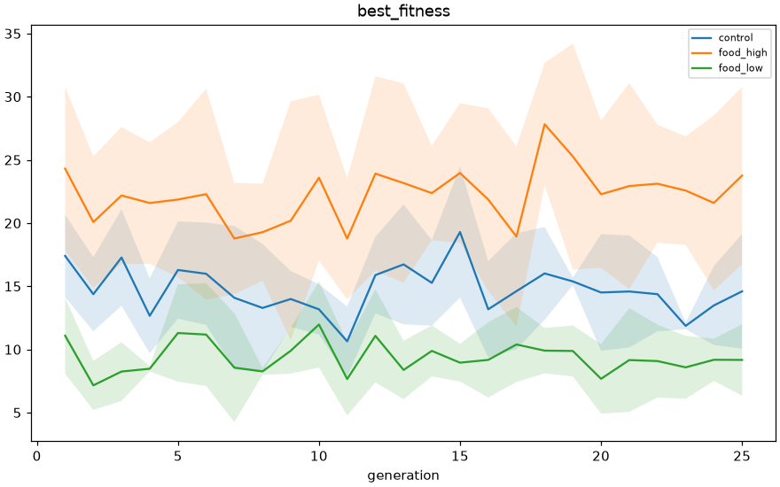
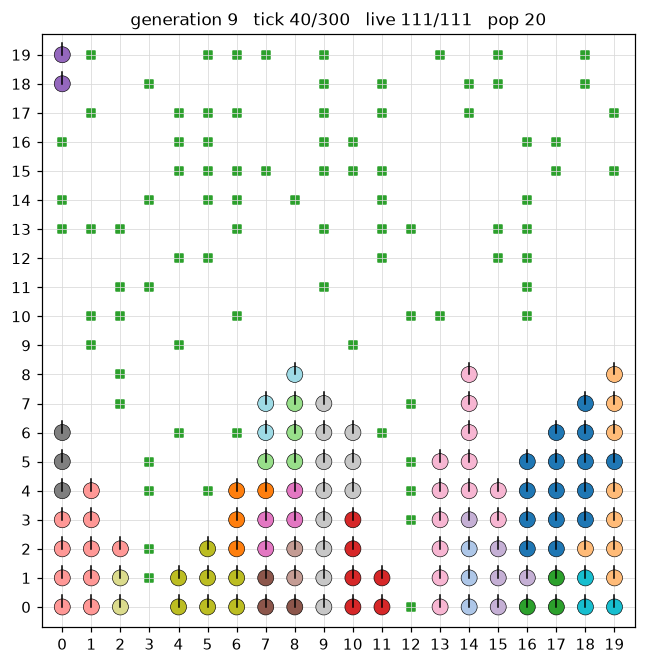

# Clage

[](https://github.com/sonawaneutkarsh/Clage/actions/workflows/ci.yml)

A from-scratch NEAT (NeuroEvolution of Augmenting Topologies) engine in a 2D world
where neural organisms move, eat and reproduce. **Clage Studio** adds a local-first
browser observatory: real-time Canvas rendering, instrumented neural inspection,
evolutionary ancestry, experiment controls, analytics and validated replay.
The original Python engine, seeded experiments and terminal/matplotlib viewers
remain independently usable. No cloud account, API key or frontend build needed.



## Start Clage Studio

```bash
python3 -m venv .venv
.venv/bin/pip install -e ".[dev,studio]"
.venv/bin/python -m studio
# Open http://127.0.0.1:8765 — starts paused. Click Resume.
```

- **Ecosystem:** zoom/pan/follow, six layers, direction markers, event pulses,
  live statistics, charts and distributions. Simulation ticks and render FPS are separate.
- **Neural atlas:** actual pre-action inputs/activations, weights, biases, enabled
  genes, semantic labels, node/edge inspection and side-by-side genome comparison.
- **Evolution:** evaluated generation summaries, champions, recorded evolutionary
  parents/net mutation deltas, and a separate within-world organism lineage.
- **Laboratory:** frozen validated settings, browser presets, seeded held-out
  policy evaluation and persistent local artifacts.
- **Replay/export:** bounded JSON/gzip archives, seeking, generation navigation,
  synchronized second-replay view, metrics CSV, chart/world PNG and champion JSON.

**Scope:** a substantial tested Studio release candidate, not a declaration that
all research-platform features are complete. One active run; replay is not a
resumable checkpoint. Recording retains at most 600 frames / 16 MiB encoded JSON.
Default Studio initialization is explicitly `dense-random-v1`, not the historical
unwired `minimal-v1`. Reconciled engine version is 0.4.1; see `CLAGE_RECONCILIATION_REPORT.md`.

[User/API/developer guide](docs/studio/GUIDE.md) ·
[Architecture](CLAGE_STUDIO_ARCHITECTURE.md) ·
[Implementation](CLAGE_STUDIO_IMPLEMENTATION_REPORT.md) ·
[Tests](CLAGE_STUDIO_TEST_REPORT.md) ·
[Performance](CLAGE_STUDIO_PERFORMANCE_REPORT.md) ·
[Final release review](CLAGE_STUDIO_FINAL_REVIEW.md) ·
[Scientific definitions](CLAGE_STUDIO_RESEARCH_NOTES.md) ·
[Remaining work](CLAGE_STUDIO_REMAINING_WORK.md)

## Historical Results

The following tables and interpretations are preserved from the pre-Studio
README at `2105fee` (five seeds each). These tables retain their original
pre-Studio measurements; current-source engine validation is recorded separately
in the final release review. The environmental experiments were not rerun during
Studio development. These are not results of the new dense-random Studio
initialization. Keep their original configurations and definitions separate.

**Engine validation** (`python -m benchmarks.run --problems or,and,xor,sin --trials 5 --generations 300`):

| Problem | Solved (of 5) | Generations to solve (min / median / max) |
|---|---|---|
| OR  | 5 | 7 / 13 / 13 |
| AND | 5 | 19 / 27 / 105 |
| XOR | 4 | 147 / 184.5 / 243 |
| sin | 0 | not solved in 300 (mean best fitness 0.91) |

**Environmental experiment** (`food_abundance.json`: 20 organisms, 25 generations,
300 ticks per generation; final-generation values, mean ± std over 5 seeds):

| Condition | Food target | Best fitness | Food eaten (all organisms) | Offspring born in-world | Champion connections |
|---|---|---|---|---|---|
| food_low  | 20  | 9.17 ± 2.83  | 10.8 ± 5.3   | 30.4 ± 5.1    | 1.0 ± 1.7 |
| control   | 60  | 14.60 ± 4.54 | 31.4 ± 9.2   | 48.2 ± 8.8    | 1.6 ± 1.5 |
| food_high | 120 | 23.76 ± 7.02 | 145.4 ± 138.7 | 144.8 ± 110.5 | 4.2 ± 2.9 |

<p>
  
  
</p>

*Left: best fitness per generation (mean ± spread over 5 seeds). Right: a recorded
generation replayed with `python -m visual replay --export-tick 40`; colour = genome,
tick marks = facing.*

What this does and does not show:

- These historical aggregates describe environmental differences, not a proven
  cross-seed separation or evidence of learned foraging.
- It is **not** a learning curve. Each generation reseeds the world, and over the
  shipped 25 generations these plots do not establish generalizable learning.
  The earlier unarchived 100-generation anecdote is not reproducible evidence.
- Evolved networks stay small (the champion has a few connections), and in every condition
  almost no organism survives the full 300 ticks.

## Setup

```bash
python3 -m venv .venv
.venv/bin/pip install -e ".[dev]"   # original engine/viewers; Studio is optional
.venv/bin/pytest                     # optional Studio API tests skip without its extras
.venv/bin/pytest --cov=neat --cov=world --cov=diversity --cov=experiments   # optional coverage
```

Requires Python 3.10+. With `.[dev,studio]` installed, the release-review suite has
**428 passing Python tests**, **4 JavaScript unit tests**, and **21 Playwright
workflows**. CI runs lint, types and Python tests on Python 3.10/3.12, plus a
separate Chromium job. See `CLAGE_STUDIO_FINAL_REVIEW.md` for the final local
verification, screenshots, unchanged-budget benchmarks and known limitations;
the pull request's checks provide the current remote CI status.

```bash
python -m pytest -o addopts='' -q
python -m ruff check .
python -m mypy neat world diversity experiments benchmarks visual studio
npm ci
npx playwright install chromium
npm test
npm run test:e2e
```

Node is needed only for frontend testing, not for running Studio. Local validation
used Python 3.13.6 and headless Chromium on macOS; see the test report for coverage
and portability limitations. The engine/viewers only require matplotlib at runtime;
Studio adds FastAPI/Uvicorn/Pydantic and its API test dependency.

Note: the packages are installed as top-level modules (`neat`, `world`, ...), so use
a dedicated virtual environment. `neat` would clash with `neat-python`.

## Quick usage

**Validate the engine** on the controlled benchmarks:

```bash
python -m benchmarks.run --problems or,and,xor,sin --trials 5 --generations 300
# writes results/benchmarks/validation_report.md and benchmarks/plots/*.png
```

**Run an environmental experiment** (one factor changed at a time, control
included, 5 seeds each):

```bash
python -m experiments.run --config experiments/configs/food_abundance.json \
       --out results --record-generation 9     # optionally omit recording
```

Raw results are overwrite-protected. Use a fresh output directory for every rerun
(for example, `--out results-second-run`); do not rerun into the same experiment
directory or delete historical artifacts just to reuse its path.

Configs shipped: `base.json`, `food_abundance`, `food_regeneration`,
`population_density`, `available_space`, `reproduction_cost`. Each condition
changes exactly one parameter (registry in `experiments/config.py`).

**Analyze and compare conditions:**

```bash
python -m experiments.analyze --results results/food_abundance \
       --report results/food_abundance/report.md
```

**Visualize:**

```bash
python -m visual tui        --recording results/food_abundance/recordings/food_high/0.json
python -m visual tui        --recording <file> --export-tick 150 --export-out frame.txt
python -m visual analytics  --results results/food_abundance                    # interactive
python -m visual analytics  --results results/food_abundance --export results/plots  # PNGs
python -m visual replay     --recording <file>                                   # animated window
python -m visual replay     --recording <file> --export-tick 40 --export-out tick.png  # one frame
python -m visual network    --recording <file> --organism 3 --export net.png
```

`tui` is a boxed terminal replay (world on the left, selected-organism info +
an ASCII neural network on the right, generation/population/species/survival/
average-fitness in the footer). Controls: arrows/WASD move a cursor, Enter
selects the organism under it (opening its network panel), Space toggles
play/pause, `q` quits. The matplotlib `replay` window has a tick slider,
play/pause/step, and click-to-inspect.

## Programmatic use

**Evolve against the world** (shared world, one run per generation):

```python
from neat import Population
from world import EnvironmentConfig, make_evaluator

config = EnvironmentConfig(width=20, height=20, ticks=200, initial_food=50, food_target=50)
pop = Population(
    fitness_fn=None,
    evaluator=make_evaluator(config),
    population_size=30,
    input_ids=list(range(9)),      # 9 observations
    output_ids=[10, 11, 12, 13],   # 4 actions
    seed=0,
)
pop.run(10)
print(pop.statistics[-1])          # best/mean fitness, species count
print(pop.best_genome)             # champion genome
```

**Evolve against a plain fitness function** (no world):

```python
from neat import Population

def fitness(genome, generation):
    return float(len(genome.connections))

pop = Population(fitness, population_size=50, seed=0,
                 input_ids=list(range(9)), output_ids=[10, 11, 12, 13])
pop.run(20)
```

**Decode a genome into a network and run it:**

```python
from neat import Network

net = Network(pop.best_genome)
outputs = net.activate([0.5, -0.2, 0.1, 0.0, 0.9, 0.3, 0.2, 1.0, 0.0])  # 9 obs -> 4 outputs
```

**Run one world generation directly:**

```python
from world import run_generation

population_genomes = pop.population
organisms = run_generation(population_genomes, config, generation=3)
for org in organisms:
    org.x, org.y, org.energy, org.food_eaten, org.age, org.offspring, org.alive
```

## Design notes you should know

Engine 0.4.1 semantically reconciles the recovered Work audit with Studio. Its
corrected evolution is `neat-reconciled-v1`; historical results are not rewritten.
Read [correctness notes](docs/correctness-notes.md) and
[reconciliation evidence](CLAGE_RECONCILIATION_REPORT.md) for provenance, limits,
and unchanged-budget benchmark results. Old replays remain viewable; rerunning
them requires the original scientific source, not the newly corrected engine.

- **Randomness is explicit.** The engine rng comes from `seed`; the world rng is
  derived per `(trial seed, generation)` via `EnvironmentConfig.world_rng_seed`.
  Same seed ⇒ identical results. Different trials are independent.
- **Fitness is world-relative per generation.** Each generation reseeds the
  world, so `best_fitness` is a champion snapshot from one generation's world;
  only `best_fitness >= current evaluated best` is guaranteed. Compare across
  seeds/conditions, not as a single absolute number.
- **Evaluation happens before reproduction.** After `pop.run(1)` returns,
  `pop.population` already holds the *unevaluated* offspring of the generation just
  finished, carrying copied or stale fitness that no longer describes their own
  structure. Read evaluated per-generation values from `pop.statistics[-1]` or
  `pop.evaluated_best_genome` (a fresh defensive copy on every read, `None` before the
  first generation) — never by scanning `pop.population`.
- **Measurement definitions.** `transition_entropy` pools boundary-respecting
  transition counts across the organisms of a genome: only action pairs consecutive
  within one organism's trace are counted, normalized by the total number of
  within-trace transitions. `food_alignment` pairs each displacement with the food
  direction observed immediately *before* the action that caused it, within a single
  trace, which excludes each trace's first recorded action (the position preceding it
  is never recorded). Results produced before this fix are **not** comparable for
  `transition_entropy`, `food_alignment` and `behavioral_diversity`.
- **No hard-coded behaviors.** Organisms move/turn/eat purely from
  observation → network → argmax action. Avoidance of other organisms is not
  even expressible (no directional organism sensor), and none of the diversity
  metrics claim cooperation, competition, aggression, or avoidance.
- **`food_alignment` is excluded** from automatic analytics charts — it is
  base-rate confounded by food density. View it only within a fixed food
  condition.
- **The engine is agnostic.** It only sees genomes and `fitness_fn`/
  `evaluator`. The `visual/` package contains no evolutionary logic; it consumes
  recorded JSON only.

More detail on the measurement fixes and the configuration validation is in
[docs/correctness-notes.md](docs/correctness-notes.md).

## Layout

```
neat/          custom NEAT engine: genome, phenotype, innovation ledger, mutation,
               crossover, speciation, population lifecycle
world/         2D walled grid: organisms, food, energy, movement, death, in-world
               reproduction, food regeneration
experiments/   config-driven one-factor-at-a-time environmental sweeps + analysis
diversity/     behavioral metrics (action entropy, transition entropy, coverage,
               food alignment, behavioral diversity index)
visual/        pure-data viewer: world replay, condition-comparison analytics,
               neural-network inspector (no evolutionary logic)
studio/        optional local API, incremental orchestration, replay contracts,
               browser assets, held-out evaluation and reproduction tools
benchmarks/    NEAT validation suite (OR / AND / XOR / sin)
tests/         Python tests, browser workflows and pure-JS tests
docs/          correctness notes, Studio guide, screenshots and measured workloads
results/       experiment and benchmark output (gitignored)
```
