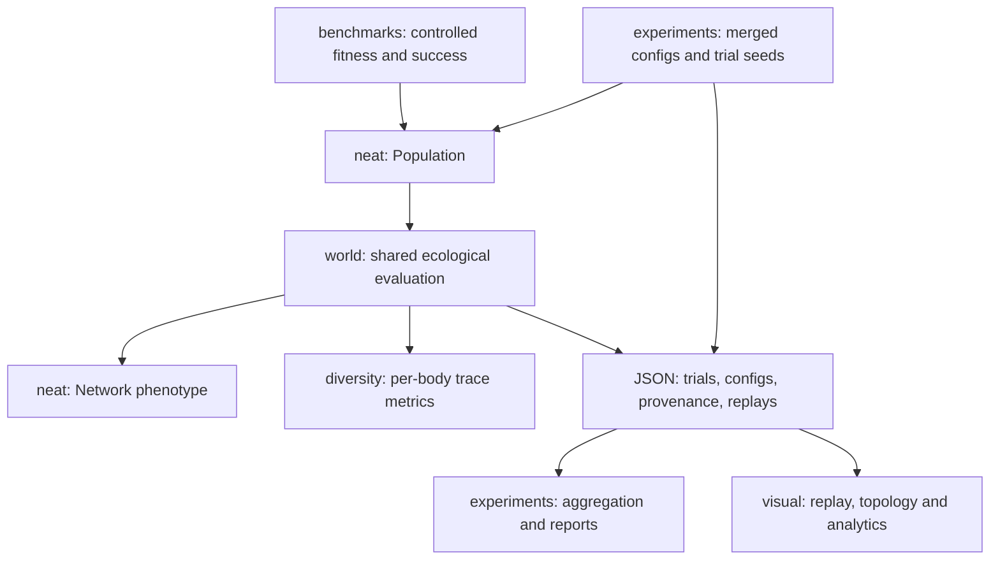

# Clage Comprehensive Audit

**Audit date:** 2026-10-07 UTC. **Repository:** https://github.com/sonawaneutkarsh/Clage.
**Baseline:** `2105fee258f2a329c351a4ab255fd585b3437a8a`.
**Review branch:** `audit/comprehensive-2026-10-07`; corrected engine 0.4.0.
Source snapshot: `bec8c03a02242d2effdeb6e553c3fdf05c1931ce`. Source references below use the final production files on this branch, unless
explicitly marked baseline. Full local commands and results are retained in the
accompanying `CLAGE_AUDIT_EVIDENCE.zip` under `audit/`.

## 1. Executive summary

Clage is a strong, understandable engineering prototype with a genuine custom
neuroevolution engine. Its original 300-test claim, benchmark table and food table
reproduced. That suite nevertheless missed consequential defects in champion
identity, first-generation preservation, species elitism, bias inheritance,
innovation registration, experiment data protection and replay fitness.

Those defects were corrected on a separate branch in focused commits. The full
suite now has **349 passing cases**, including 49 targeted new cases; Ruff and
Mypy pass. All six shipped experiment configs ran before and after the main
corrections: **160 condition/seed trials, 4,000 world generations** in total.
The separate frozen MOVE control adds 15 trials/375 generations. Bounded final
source checks add 66 generations. Raw results were kept separately.

XOR solved 4/5 baseline seeds and 5/5 corrected seeds. OR and AND remained 5/5;
sin remained 0/5 at 300 generations. This finite comparison supports improved
behavior on these runs; it does not isolate a particular fix's contribution or
prove a general increase in evolutionary performance.

The research platform needs more work than the engine demonstration. Food
availability strongly affects fitness and births even without evolution. Missing
facing information, automatic early reproduction, shared-world competition and
maximum-over-descendants fitness are concrete mechanisms to investigate. Current
measurements do not establish intelligence, cooperation, adaptive competition
or generalizable learning. The README now states that explicitly.

The UI was actually exercised in a terminal PTY and through matplotlib canvas
events; rendered replay, topology, tables and charts were inspected visually.
Native desktop-window interaction is **unverified** because the environment has
no display. Final isolated timings show about **28% less inference time** and
**12% less default-world time** on this machine, with exact reference outputs
and matching seeded replay hashes.

## 2. Repository architecture



| Area | Responsibilities and dependencies | Main execution anchors |
|---|---|---|
| `neat/` | Genome/genes, historical IDs, seven mutation operators, crossover, compatibility/sharing/budgets, feed-forward execution, population lifecycle; no world dependency | `neat/population.py:197`, `neat/phenotype.py:109` |
| `world/` | Config validation, occupancy/food, observations, actions, energy, births, mortality, fitness and recorder | `world/simulation.py:75`, `world/organism.py:86` |
| `experiments/` | Single-level config inheritance, named environmental interventions, seed orchestration, metrics, aggregation and reports | `experiments/config.py:255`, `experiments/run.py:100`, `experiments/analysis.py:64` |
| `diversity/` | Entropies, coverage, alignment, encounters, per-genome fingerprints and population distances | `diversity/metrics.py:222`, `diversity/metrics.py:351` |
| `visual/` | Standard-library JSON loading, layered topology layout, terminal cells, matplotlib replay/buttons/slider, analytics | `visual/data.py:49`, `visual/world_view.py:103`, `visual/terminal_view.py:311` |
| `benchmarks/` | Explicit targets/success rules, seeded Population trials, smoke diagnoses, plots and Markdown | `benchmarks/problems.py:24`, `benchmarks/run.py:128` |
| `tests/`, docs, packaging, CI | 12 original test modules plus five audit modules; setuptools; Python 3.10/3.12 CI | `audit/test-inventory.json`, `pyproject.toml:1`, `.github/workflows/ci.yml:15` |

Evaluation happens before reproduction. After `run(1)`, `population` contains
unevaluated offspring; `evaluated_best_genome` is a defensive copy of the last
evaluated winner; `best_genome` archives historical raw fitness. See
`neat/population.py:174` and `docs/architecture.md`.
This distinction is essential for both benchmark validity and viewer labels.

## 3. Existing strengths

- Small dependency surface and explicit RNG injection make failures tractable.
  The core can evaluate a plain function or a shared-world batch evaluator.
- Feed-forward DAG validation, copying, innovation matching, cycle rejection,
  disabled-wire handling and seeded tests provide a substantial foundation.
- The original evaluation/measurement fixes already correctly used evaluated
  champions and trace-local transitions/alignment. These were preserved.
- Config snapshots, five-seed sweeps, honest acknowledgment of weak learning,
  semantic control conditions, terminal export and headless PNG workflows exist.
- `visual/data.py` has no engine imports. Visualization does not simulate or
  change the saved experiment. This separation is worth preserving.
- Baseline CI really passed at the pinned commit: run
  [37535432573](https://github.com/sonawaneutkarsh/Clage/actions/runs/37535432573).
  Earlier failures do not contradict that exact-head success.

## 4. Confirmed bugs and correctness problems

The following counterexamples were executed. The backlog in section 12 records
priority, remedy, cost, risk and acceptance criteria for each issue.

| IDs | Before | Corrected behavior / supporting evidence |
|---|---|---|
| C01 | Weight +2 and −2 counted as the same champion because only structural shape was compared; generation-one best could disappear | Exact inherited genotype identity and archive before reproduction; `tests/test_neat_audit.py`, `audit/logs/baseline-neat-regressions.log` |
| C02 | Four founders in small species with elitism 4 produced only two children | Available elite count is included in the cap; population size stays four over multiple generations |
| C03 | Shared biases −1/+1 always inherited −1 from parent A across 20 seeds | Shared unequal biases can come from either parent; parents remain unchanged |
| C04 | Custom interface IDs 14/15 collided with default hidden ID 14; imported innovation 99 became 1 in the ledger | Register/reserve known IDs/history; incompatible histories fail clearly |
| C05 | Duplicate interface IDs silently dropped/retyped nodes; duplicate innovations collapsed in dictionaries; hidden→INPUT wires were accepted but not executed | Reject inconsistent representations at construction/validation/crossover |
| C06–C08 | Empty distance normalization divided by zero; invalid generation counts/founder count were accepted; diagnostics passed Random as generation and could reproduce an empty population | Targeted validation; integer callback; extinction recovery |
| D01–D03 | Duplicate seeds wrote the same file; normal reruns replaced raw results; ragged aggregation crashed or silently truncated | Seed/path validation, fresh-output protection, provenance and strict row validation |
| D04 | Recorder captured inherited fitness 99 although current evaluation produced 9.05 | Replay v2 finalizes evaluated fitness and labels its phase |
| W01–W02 | Odd-grid center boundary values were negative; transfer fraction 0/1 left exhausted bodies alive | Nonnegative proximity; immediate starvation after transfer, preserving birth count |
| B01 | Generation budget zero caused UnboundLocalError; invalid names caused KeyError; zero trials led to empty-report failures | Positive integer budgets and explanatory CLI errors |
| V01–V03 | North arrow contradicted world motion; replay initially blank/incorrect play label; invisible TUI cursor, cell-width drift, buffered input, crowded labels | Correct row orientation, controls, fixed-width food, cursor/selection, byte input, readable topology/table |
| E01 | Built wheel contained none of six shipped JSON configs | Explicit config package data; all six files present and installed-wheel smoke passes |

Core/data/viewer regression additions were first run against pre-fix production
code and failed. Four later boundary tests also failed before their fixes.
The two independent performance oracles are intended to pass both versions;
the odd-grid test covers the boundary correction. See all attempts and exit
codes in `audit/commands.jsonl`; a passing final suite is not used to hide failed
investigation attempts.

## 5. NEAT algorithm findings

Primary comparisons: Stanley and Miikkulainen's
[2002 paper](https://nn.cs.utexas.edu/downloads/papers/stanley.ec02.pdf), §§3.1–3.4,
and NEAT-Python's official
[gene crossover source](https://neat-python.readthedocs.io/en/latest/_modules/genes.html)
and [reproduction source](https://neat-python.readthedocs.io/en/latest/_modules/reproduction.html).
References establish the mechanisms, not equivalence of success rates.

| Mechanism | Clage assessment |
|---|---|
| Historical markings | Run-persistent endpoint and split ledger, rather than the paper's per-generation innovation reuse. An intentional variant; existing-ID collisions were separate bugs, now fixed. |
| Minimal initialization | No hidden nodes **and no wires**; the paper starts with connected input/output networks. This changes early exploration and makes initial MOVE behavior uniform. |
| Crossover | Innovation alignment, fitter-parent disjoint/excess selection, 50% equal-fitness policy and 75% disable rule are explicit. Bias inheritance needed repair. Union of all parent nodes can leave unused hidden nodes. |
| Speciation | Distance is excess/disjoint plus matching-weight difference, small-genome normalization, deterministic fittest representative. The paper uses random representatives. Bias/enable-state differences are not in Clage's distance. |
| Sharing/budgets | Raw fitness divided by species size; nonnegative species weights and largest-remainder allocation. Negative values are legal but clipped for selection; all-negative fitness becomes effectively uniform, losing negative rank information. |
| Stagnation/elites | Persistent age/stagnation and per-species elitism. Full extinction is rescued by champion copies. Champion rescue remains active with elitism zero: documented behavior, not a no-elitism ablation. |
| Phenotype | Deterministic, tanh, sorted interface IDs, enabled DAG execution; recurrent policies deliberately unsupported. Independent recursive DAG oracle matches exact outputs on 200 random input/genome combinations. |

Anchors: `neat/innovation.py:97`,
`neat/crossover.py:33`, `neat/speciation.py:133`,
`neat/speciation.py:227`, `neat/speciation.py:239`,
`neat/population.py:315`, `neat/phenotype.py:63`.

These variants should be versioned and ablated rather than silently changed to
match another implementation. OR/AND/XOR success means all four truth-table
outputs are within 0.5 of target; it is not a common fitness threshold.
Sin uses 21 training points with MAE below 0.1 while selection optimizes MSE
(`benchmarks/problems.py:44`, `benchmarks/problems.py:105`).
The hand-built XOR diagnostic uses weights ±20/bias −30, outside mutation
bounds ±3. It proves execution/representation only, not reachable bounded search.

## 6. Artificial-life simulation findings

| Observation index | Definition | Main limitation |
|---:|---|---|
| 0–1 | Nearest food dx/dy normalized by half the larger world dimension and clipped to ±1 | Absolute coordinates; no facing to translate them into relative actions |
| 2–3 | Local food/other-body densities in a square neighborhood | Scalar crowding gives no direction of neighbors |
| 4 | Energy / maximum energy | Useful internal state |
| 5–6 | Axis-wise boundary proximity | No direction to the nearer wall; odd-size sign bug fixed |
| 7–8 | Previous MOVE/EAT indicators | Two bits, not full orientation or recurrent memory |

Source: `world/organism.py:55`. Actions are MOVE, TURN_LEFT,
TURN_RIGHT, EAT. MOVE automatically consumes destination food; EAT consumes
ahead without movement. Argmax ties choose MOVE. Turns have no additional
explicit cost beyond per-tick metabolism. Bodies block movement, compete for
cells/food, and act in deterministic list order. Newborns act next tick; food
regenerates afterward (`world/organism.py:115`,
`world/simulation.py:119`).

Confirmed operational probes (`audit/final/science-probes.json`): differently
facing bodies at the same location produce identical observations; four founders
in a zero-food world produce four births on tick one. Initial energy 1.0 exceeds
reproduction threshold 0.7 after metabolism. Births therefore do not require
successful foraging. This is a research design concern, not proof of an energy
conservation defect: the transfer splits existing energy.

Fitness is `3*food + .01*age + .5*births`; each genome receives its highest
individual score over a founder and clonal descendants
(`world/fitness.py:13`, `world/simulation.py:132`).
Larger lineages get more opportunities for a lucky maximum, and founder placement,
body order and competing policies affect it. All-time raw-fitness archives can
preserve a genotype lucky in a prior layout. Neither score measures intelligence.

### Falsifiable hypotheses, kept separate from bug fixes

| Hypothesis / issue | Proposed intervention | Cost | Evidence that would falsify it |
|---|---|---|---|
| R02: missing facing limits directed foraging | Versioned two facing inputs or body-relative food direction; preserve all ecological settings | 1–2 days plus trials | No held-out food/lifetime improvement over corrected nine-input engine under matched evaluation budget |
| R03: automatic births weaken resource pressure | Separately compare existing reproduction with resource-contingent eligibility; retain historical scheme | 2–3 days | Policies trained under the alternative fail to improve held-out foraging after controlling for food supply |
| R04: maximum-descendant score rewards opportunity more than control | Compare founder score, lineage mean and current maximum on common held-out layouts | 2–3 days | Current maximum ranks policies at least as consistently by held-out food acquired per founder |
| R05/R08: noisy worlds and five trials hide progress | Fixed held-out layout bank, body-order randomization ablation, prespecified primary outcome, paired uncertainty | 2–4 days | Training winners fail to outperform frozen and random-policy controls on held-out layouts |
| R09: unwired start and small effective mutation rates slow exploration | Isolated wired/unwired, crossover-off, bias-distance and mutation-rate ablations | 1–3 days | Equal-budget performance distributions show no useful change; increasing complexity alone does not count |
| R10: sine failure reflects bounded search/representation limits | Verify a hand solution inside bounds, then small topology/bias/weight ablations with held-out x points | 1–2 days | A bounded, equal-budget control solves reliably while the engine still fails, directing attention to search mechanics |

No intervention in this table was applied to the shipped scientific definitions.

## 7. Scientific validity and reproducibility

**Seed independence versus exact environment matching.** The world seed hashes
trial seed and generation; explicit engine RNG remains isolated. Same seeds are
useful for paired analyses but do not produce identical ecological trajectories:
founder placement consumes RNG before food, founder counts differ, and policies
change occupancy and later random draws. A 64-bit seed hash removes systematic
additive collisions; it cannot promise no mathematical collisions or identical
world layouts across platforms. `seed_stride` is validated but unused by this
hash scheme (`world/config.py:188`).

**Interventions are OFAT by named factor, not full causal isolation.** Food
abundance changes initial food and target; space changes both dimensions and
food/body density; population density changes founder count and crowding.
`reproduction_cost.json` actually varies threshold, holding transfer fraction at
0.5. These are legitimate ecological interventions when labelled accurately,
but condition differences do not isolate policy improvement. Config registry:
`experiments/config.py:36` and `experiments/configs/*.json`.

**Controls.** The predeclared frozen control disables mutation/crossover,
retains every genome and prevents stagnation pruning, while retaining all world
rules/seeds/generation reseeding. Zero-wired zero-bias outputs choose MOVE.
It is one control representing both a fixed-forward policy and a frozen initial
population. Script/config/records: `audit/profile_and_controls.py`,
`audit/baseline/frozen-control.json`. It is not a random-policy or deliberate
foraging baseline, nor a held-out test.

| Condition | Frozen MOVE mean | Baseline evolving mean | Corrected evolving mean | Corrected − frozen, paired mean ± SD |
| --- | --- | --- | --- | --- |
| food_low | 9.178 | 9.168 | 7.756 | -1.422 ± 1.947 |
| control | 15.778 | 14.596 | 17.534 | +1.756 ± 3.522 |
| food_high | 22.302 | 23.758 | 28.400 | +6.098 ± 8.634 |

Paired differences use the same trial seed and final generation. The control's
world physics is unchanged; five default-world replay hashes match baseline
and final code exactly. The corrected high-food delta is suggestive, but one
seed is negative, and there are only five seeds. No significance, generalized
learning or per-fix causal effect is claimed. Every paired value is in
`audit/result-summary.json`.

**Metrics.** Action entropy quantifies action proportions; one-step conditional
transition entropy quantifies unpredictability given the preceding action,
not the entropy rate of an arbitrary long-memory policy. More entropy can mean
randomness rather than competence. Coverage depends on world area and lifespan;
encounter rate depends on density. Alignment has a food-density base-rate confound
and cannot establish food seeking across different abundance conditions.
Sources: `diversity/metrics.py:50`,
`diversity/metrics.py:144`,
`diversity/metrics.py:174`, `diversity/metrics.py:210`.

The behavioral-diversity index z-scores each column **within the population**
then averages pairwise distances. Differences [0,1] and [0,1e−12] both give
sqrt(2), as the executable probe shows. Identical MOVE policies can have
nonzero diversity through different placements/experiences. Use raw components
or normalization fitted on an independent reference distribution for cross-run
comparisons; change the metric schema when doing so.

**Reporting/provenance.** Sample SD describes variation across five seeds;
shaded bands are not confidence intervals. Generations within a trial are not
independent replicates. The earlier unarchived 100-generation anecdote is
unverified, and the baseline README's “separate cleanly and consistently” was
too strong for overlapping/spread-out five-seed observations. Both claims were
removed from the current README; verified historical numbers were preserved.

Manifests now retain actual source hashes, merged configs, Python/platform,
matplotlib, seed list, semantic control and git commit if available
(`experiments/run.py:213`). Source hashes are authoritative
when working bytes differ from HEAD. Full final sweeps preceded the later
odd-grid/transfer-endpoint/invalid-budget/docstring/package changes; their
manifests are not rewritten. All shipped grids are even and fractions are 0.5.
Current-source first-generation checks cover every condition, plus complete
25-generation control/high-food seed-0 trials matching every saved row exactly
(`audit/final/current-source-recheck.json`).

## 8. Testing and reliability findings

Baseline: **300 collected cases**, 255 test functions across 12 files (pytest
parameterization explains the difference). It passed despite the confirmed
counterexamples. Final: **349 cases** across 17 files. Additions cover exact
champion parameters, generation-one preservation, multi-species size, bias
inheritance, custom IDs/history conflicts, illegal representation, budgets,
callbacks, seed integrity, protected output, replay fitness, aggregation, row
orientation, cursor/controls, energy endpoints and diagnostic extinction.

The independent DAG evaluator uses recursion and memoization rather than the
production topological loop. Density tests use a direct neighborhood oracle
including edges, outside points, exclusion and radii. These do more than restate
implementation. See `tests/test_performance_audit.py` and four other audit files.
Four old fixtures were adjusted to valid shared innovation history or a genuine
hidden-node cycle; assertions were retained, not weakened to hide failures.

| Code regime | Passing cases | Covered statements | Coverage |
| --- | --- | --- | --- |
| baseline | 300 | 2002 / 2686 | 74.53% |
| final | 349 | 2216 / 2887 | 76.76% |

Coverage is statement coverage from the test suite only, across all six packages.
Manual CLI/rendering/PTY execution adds evidence but is not counted as test
coverage. Benchmark reporting/plots and experiment report CLI still have little
or no automated coverage; interactive terminal replay remains 61% and native
window integration unverified. Ruff's F/E9 rule set and non-strict Mypy are
useful checks, not evidence of exhaustive numerical or semantic correctness.

Remaining reproduced hardening gaps: `Genome.validate()` accepts NaN bias;
malformed deserialized ledger counters can reuse an innovation; modifying a
dictionary obtained through `statistics` mutates engine history. These are
explicit remaining issues, not exercised by valid shipped configs. Evidence:
`audit/hardening_probes.py`, `audit/hardening-probes.json`; R/E backlog below.
Mutation/speciation config validation and full replay schema validation also
need boundary work. No arbitrary huge-range fuzzing or third-party testing
dependency was introduced.

## 9. Performance profiling results

Baseline cProfile: 20 unwired genomes, control world, seed/generation 0, 300 ticks;
71 bodies and 7,133 actions. About 72% of profiled cumulative time was sensing:
organism density .119 s, nearest food .053 s, food density .030 s; activation
.041 s. Total .328 s/623,806 calls. Final profile: .190 s/329,250 calls,
organism density .032 s, activation .021 s. Profiling overhead changes the
apparent ratio; the unprofiled comparison below is the speed evidence.

| Workload, median of 7 repetitions | Baseline | Final | Less elapsed time |
| --- | --- | --- | --- |
| 100,000 dense-network activations | 0.303767 s | 0.218241 s | 28.2% |
| 10 default control worlds | 1.172586 s | 1.037167 s | 11.5% |

Inference measures seven repetitions of 100,000 calls to the same dense 9×4
network and input. World timing measures seven repetitions of ten fresh
20-founder control worlds. Baseline/final were sequential, using the same Python
environment and explicitly selected source worktree. These are single-machine,
small-workload measurements; no general throughput or memory savings are promised.
The later starvation guards reduce the world gain from an intermediate ~18%
to final ~12%, which is the number used here.

Optimizations compile noninput `(node,bias,incoming)` execution plans and scan
clipped occupancy rows directly. Float summation/edge order and density's original
full-neighborhood denominator are preserved. Fitness vectors and five recorded
tick-state hashes match exactly. Evidence: `audit/{baseline,final}/inference.json`,
`runtime.json`, `neutral.json`, `.prof`, and `audit/verify_outputs.py`.

No occupancy index was added: random-empty-cell scans were ~1% in the baseline
profile. Nearest-food is linear in food count, speciation is roughly genomes ×
species × genome size, all-pairs diversity is quadratic, and recorder work scales
with ticks × all bodies ever born. Those costs justify bounded scale profiling
before indices, parallel orchestration or streaming storage. Full-run wall times
and child RSS are recorded; overlapping final experiments prevent a fair
whole-benchmark speed comparison. Profiling evolution/serialization at large
scale remains a limitation; no bottleneck there was claimed without measurement.

## 10. Visualization and UX findings

**Actual execution/inspection.** Baseline terminal started in a PTY, paused,
received movement/Enter input and quit; selection was not visibly confirmed.
Final `audit/tui_interaction.py` drives the real viewer with PTY bytes: pause,
seven right/four down, Enter selecting body 0, up-arrow and quit. The observed
tick remains 1 while paused, energy 50%, food 1 and cursor coordinates update.
Screens are retained as `audit/final/tui-pty.{raw,txt}`.

Matplotlib canvas mouse events exercised pause, step, slider tick 40 and a live
body click opening topology; animation paused at its final tick. Event outcomes
are `audit/final/widget-events.json`. PNGs were inspected before/after; native
desktop windows cannot be tested without a display. This is a partial limitation
of the mandatory computer-interaction phase, not a claim that desktop input was
verified.

| View | Repaired | Remaining user-value opportunities |
|---|---|---|
| World replay | Correct north/row direction; initial tick visible; control state faithful; no duplicate draw per animation step | Species/lineage legend, keyboard stepping, selected-body state beside world, stable palette beyond 20 genomes |
| Terminal | Visible bounded cursor, single-column food, ID, % energy, explicit final fitness label, unbuffered keys, no paused redraw flood | Eight network rows merge some of nine inputs; no node IDs/weights; terminal size handling and monochrome distinctions |
| Topology | Spacious node/bias labels, edge arrows, sign/disabled legend, explicit unwired behavior | Semantic sensor/action labels, activation overlays, pruning irrelevant nodes and zoom for large evolved DAGs |
| Analytics | Transposed readable parameter table; unknown metrics fail clearly; exports create parents | Seed points, uncertainty labels/held-out overlays, accessible palettes, comparative dashboard in existing matplotlib |

Before/after paths: `audit/{baseline,final}/tick.png`, `network.png`,
`analytics/environmental_parameters.png`, analysis/analytics metric PNGs.
New README images are `docs/img/audit-*.png`; original images were retained.
Color represents genome, not species. A static topology is not an explanation
of why an action occurred; activations were not recorded. Avoid making that
interpretation in demonstrations.

## 11. Documentation and portfolio assessment

| Reviewer | Current strength | Most valuable next evidence |
|---|---|---|
| Research professor | Transparent definitions, custom engine, controls and limitations | Held-out policy comparisons, uncertainty and prespecified ablations |
| ML research engineer | Inspectable genetics, deterministic interfaces, valid regression oracles | Bounded-search diagnostics, fixed-budget ablations, recoverable run metadata |
| Software recruiter | Working install/CI, coherent modules, replay images and focused bug fixes | A concise 60-second demo connecting code, behavior and verification |
| Contributor | Architecture/data contracts and prioritized issues now available | Small independently reviewable milestones, CLI integration checks, checkpoint contracts |

README now leads with purpose, 349 verified cases, observed benchmark results,
the unresolved research question and working commands. Its duplicate run commands
were replaced by one recording run using a fresh output root. The programmatic
example now keeps the world's nine-input population distinct from generic
ten-input defaults and was executed as written. Stale “nothing evolves yet,”
missing architecture references, misleading canonical-history wording and
absolute collision-free hash claims were corrected. No unsupported long-run
trend, intelligence or cooperation claim was added.

## 12. Complete prioritized improvement backlog

Priority follows the requested meanings: P0 correctness/data integrity; P1 major
engineering/reproducibility/usability or scientific validation; P2 valuable
noncritical work; P3 low-return polish. Severity concerns the consequence, while
priority also considers impact/time. Costs are estimates of focused implementation
plus initial verification, not promises. L/M/H = low/medium/high regression risk.
Each entry states evidence/root cause, benefit, remedy and verification; the
inventory includes completed work so no substantive finding disappears.

| ID | Priority | Area / kind | Severity | Status | Estimated work | Risk |
| --- | --- | --- | --- | --- | --- | --- |
| [C01](#c01) | P0 | neat/population / Bug | High | Fixed | 0.5 day | M |
| [C02](#c02) | P0 | neat/population / Bug | High | Fixed | 0.25 day | L |
| [C03](#c03) | P0 | neat/crossover / Bug | High | Fixed | 0.25 day | M |
| [C04](#c04) | P0 | neat/innovation, mutation / Bug | High | Fixed | 1 day | M |
| [C05](#c05) | P0 | neat/genome, crossover / Bug | High | Fixed | 0.5 day | M |
| [C06](#c06) | P1 | neat/speciation / Bug | Medium | Fixed | 0.1 day | L |
| [C07](#c07) | P1 | neat/population / Bug | Medium | Fixed | 0.25 day | L |
| [C08](#c08) | P1 | neat/diagnostics / Bug | Medium | Fixed | 0.25 day | L |
| [D01](#d01) | P0 | experiments/config / Bug | High | Fixed | 0.5 day | L |
| [D02](#d02) | P0 | experiments/run / Data integrity | High | Fixed | 0.75 day | M |
| [D03](#d03) | P0 | experiments/analysis, visual/data / Bug | High | Fixed | 0.5 day | L |
| [D04](#d04) | P0 | world/recorder / Bug | High | Fixed | 0.5 day | M |
| [W01](#w01) | P1 | world/organism / Bug | Medium | Fixed | 0.1 day | L |
| [W02](#w02) | P1 | world/organism / Bug | Medium | Fixed | 0.25 day | M |
| [B01](#b01) | P1 | benchmarks/run / Bug | Medium | Fixed | 0.25 day | L |
| [V01](#v01) | P1 | visual/world_view / Bug | Medium | Fixed | 0.5 day | L |
| [V02](#v02) | P1 | visual/terminal_view / Usability bug | Medium | Fixed | 0.75 day | M |
| [V03](#v03) | P2 | visual/network_view, analytics, app / Usability | Low | Fixed | 0.5 day | L |
| [P01](#p01) | P1 | neat/phenotype, world/grid / Performance | Medium | Fixed | 0.5 day | M |
| [E01](#e01) | P1 | pyproject / Packaging bug | Medium | Fixed | 0.25 day | L |
| [DOC01](#doc01) | P1 | README, docs, source comments / Documentation | Medium | Fixed | 1 day | L |
| [R01](#r01) | P1 | experiments, world / Research limitation | High | Partial | 2–4 days + trials | H |
| [R02](#r02) | P1 | world/organism / Research hypothesis | High | Proposed | 1–2 days + trials | H |
| [R03](#r03) | P1 | world/organism, fitness / Research limitation | Medium | Proposed | 2–3 days + trials | H |
| [R04](#r04) | P1 | world/simulation, fitness / Research limitation | High | Proposed | 2–3 days + trials | H |
| [R05](#r05) | P1 | neat/population, evaluator / Research limitation | High | Proposed | 2 days + trials | H |
| [R06](#r06) | P1 | diversity/metrics / Measurement limitation | High | Partial | 1–2 days + trials | M |
| [R07](#r07) | P1 | experiments/configs / Experimental design | Medium | Partial | 1–2 days + trials | M |
| [R08](#r08) | P1 | experiments/analysis, world RNG / Statistical limitation | High | Partial | 1–2 days + trials | M |
| [R09](#r09) | P2 | mutation, speciation, initialization / Algorithm research | Medium | Proposed | 1–3 days + trials | H |
| [R10](#r10) | P1 | benchmarks/diagnose, problems / Benchmark research | Medium | Partial | 1–2 days + trials | M |
| [C09](#c09) | P2 | neat/crossover, metrics / Design limitation | Medium | Proposed | 0.5–1 day | M |
| [V04](#v04) | P2 | visual/terminal, replay / Feature/usability | Medium | Proposed | 1–2 days | M |
| [V05](#v05) | P2 | world/recorder, visual / Feature | Low | Proposed | 1–2 days | M |
| [E02](#e02) | P2 | experiments/run, Population / Feature/reliability | Medium | Proposed | 2–4 days | H |
| [E03](#e03) | P2 | Genome, InnovationDB, viewer schemas / Confirmed hardening gap | Medium | Open | 1–2 days | M |
| [E04](#e04) | P2 | neat/population / API debt | Medium | Open | 0.5–1 day | M |
| [E05](#e05) | P3 | pyproject, dependency policy / Packaging debt | Low | Open | 0.25 day | L |
| [E06](#e06) | P1 | benchmarks/run / Reproducibility debt | Medium | Open | 0.5–1 day | L |
| [E07](#e07) | P1 | tests, CI / Reliability debt | Medium | Partial | 1–2 days | M |
| [E08](#e08) | P2 | world, diversity, speciation, recorder / Performance proposal | Medium | Proposed | 1–2 days | M |
| [P02](#p02) | P2 | world/config / Configuration debt | Low | Partial | 0.25 day | L |
| [DOC02](#doc02) | P3 | README, visual demos / Portfolio feature | Low | Proposed | 0.5–1 day | L |

### C01

**Champion identity and first-generation preservation** — P0; Bug; high severity; fixed. Area: `neat/population`. Complexity: 0.5 day; risk M.

**Evidence / root cause:** `neat/population.py:62`; tests/test_neat_audit.py. Structure-only identity omitted weights/biases/enabled state; archive updated too late.

**Expected benefit / recommended solution:** Preserve the evaluated policy, using exact inherited genotype and tracking before reproduction.

**Verification criterion:** Parameter-different children cannot stand in for the champion; generation-one deterioration preserves the winner.

### C02

**Species elites could shrink the population** — P0; Bug; high severity; fixed. Area: `neat/population`. Complexity: 0.25 day; risk L.

**Evidence / root cause:** `neat/population.py:291`; four-founder regression. Elite count exceeded available members while the offspring loop subtracted the larger count.

**Expected benefit / recommended solution:** Cap elites by budget, config and available members; preserve population size.

**Verification criterion:** Four founders stay four for three generations with elitism four and unequal species budgets.

### C03

**Parent-A bias inheritance** — P0; Bug; high severity; fixed. Area: `neat/crossover`. Complexity: 0.25 day; risk M.

**Evidence / root cause:** `neat/crossover.py:33`; shared-bias seeded regression. Shared nodes were copied from A without recombining their learned bias.

**Expected benefit / recommended solution:** Choose shared unequal biases from either parent; equal values consume no extra RNG.

**Verification criterion:** Both −1 and +1 appear across 20 fixed seeds and parents remain unchanged.

### C04

**Imported history and custom ID collisions** — P0; Bug; high severity; fixed. Area: `neat/innovation, mutation`. Complexity: 1 day; risk M.

**Evidence / root cause:** `neat/innovation.py:68`; tests/test_neat_audit.py. Default counters ignored existing genes and interface IDs.

**Expected benefit / recommended solution:** Register known endpoint/innovation pairs, reserve node/innovation maxima and reject conflicts.

**Verification criterion:** IDs 14/15 split above 15; innovation 99 stays 99; conflicting histories fail before mutation.

### C05

**Invalid genome representation silently loses information** — P0; Bug; high severity; fixed. Area: `neat/genome, crossover`. Complexity: 0.5 day; risk M.

**Evidence / root cause:** `neat/genome.py:164`; duplicate/INPUT regressions. Dictionary conversion hides duplicate innovations/interface IDs; INPUT destinations are never executed.

**Expected benefit / recommended solution:** Reject duplicate/overlapping interfaces, duplicate innovations, conflicting roles/endpoints and incoming INPUT wires.

**Verification criterion:** Invalid examples fail explicitly; valid hidden-node cycles still exercise cycle prevention.

### C06

**Empty compatibility normalization crash** — P1; Bug; medium severity; fixed. Area: `neat/speciation`. Complexity: 0.1 day; risk L.

**Evidence / root cause:** `neat/speciation.py:133`. Empty connection counts with threshold zero made N zero.

**Expected benefit / recommended solution:** Floor N at one, retaining normal distance definitions.

**Verification criterion:** Identical unwired genomes have zero distance at small_genome_threshold zero.

### C07

**Invalid generation/founder-count boundaries** — P1; Bug; medium severity; fixed. Area: `neat/population`. Complexity: 0.25 day; risk L.

**Evidence / root cause:** `neat/population.py:157`; explicit founder-count test. Python ranges quietly accepted negative/bool counts, and size could disagree with supplied founders.

**Expected benefit / recommended solution:** Reject invalid generation types/ranges and inconsistent explicit size.

**Verification criterion:** Rejected runs leave generation unchanged; valid zero-generation run remains supported.

### C08

**Diagnostic callback and total extinction failures** — P1; Bug; medium severity; fixed. Area: `neat/diagnostics`. Complexity: 0.25 day; risk L.

**Evidence / root cause:** `neat/diagnostics.py:64`; tests/test_boundary_audit.py. Random was passed as generation; empty species allocation could yield an empty next population.

**Expected benefit / recommended solution:** Pass integer generation and reassign the evaluated population after full pruning.

**Verification criterion:** Generation-aware callback gets 0,1,2; flat fitness evaluates three genomes on every one of five generations.

### D01

**Seed/path integrity** — P0; Bug; high severity; fixed. Area: `experiments/config`. Complexity: 0.5 day; risk L.

**Evidence / root cause:** `experiments/config.py:147`; tests/test_data_audit.py. Duplicate seeds map to the same filename; direct configs and names lacked boundary checks.

**Expected benefit / recommended solution:** Require unique integer seeds and safe single-component names; resolve valid positive generation budgets.

**Verification criterion:** Duplicate, bool/float/empty seeds and traversal names fail before files are written.

### D02

**Raw overwrite and missing provenance** — P0; Data integrity; high severity; fixed. Area: `experiments/run`. Complexity: 0.75 day; risk M.

**Evidence / root cause:** `experiments/run.py:213`; `experiments/run.py:244`. Runner reused output paths and recorded parameters without actual source identity.

**Expected benefit / recommended solution:** Protect nonempty runs/seed targets and record source hashes, merged config, runtime and control.

**Verification criterion:** Reruns reject existing data without changing bytes; fresh runs contain resolvable manifest metadata.

### D03

**Ragged or corrupt aggregate input** — P0; Bug; high severity; fixed. Area: `experiments/analysis, visual/data`. Complexity: 0.5 day; risk L.

**Evidence / root cause:** `experiments/analysis.py:64`; `visual/data.py:91`. Aggregators trusted first trial length, implicit positions and numeric fields.

**Expected benefit / recommended solution:** Validate nonempty equal lengths, one-based generations and finite required metrics.

**Verification criterion:** Both data layers reject length/order/nonfinite defects and agree on valid statistics.

### D04

**Replay shows inherited fitness** — P0; Bug; high severity; fixed. Area: `world/recorder`. Complexity: 0.5 day; risk M.

**Evidence / root cause:** `world/recorder.py:123`; evaluated-fitness regression. Genomes serialized before the world stamped current fitness.

**Expected benefit / recommended solution:** Finalize after evaluation, write replay v2 and explicitly label fitness phase; retain v1 read support.

**Verification criterion:** Inherited 99 becomes evaluated 9.05; v1 retains cautious labels; invalid versions/empty ticks fail.

### W01

**Negative boundary proximity on odd grids** — P1; Bug; medium severity; fixed. Area: `world/organism`. Complexity: 0.1 day; risk L.

**Evidence / root cause:** `world/organism.py:66`; tests/test_performance_audit.py. Even-grid normalization was reused for odd dimensions.

**Expected benefit / recommended solution:** Use the floor of half the interior span, keeping even dimensions identical.

**Verification criterion:** 5×7 center has zero axis proximity; shipped even-grid replay hashes stay identical.

### W02

**Alive zero-energy body after reproduction** — P1; Bug; medium severity; fixed. Area: `world/organism`. Complexity: 0.25 day; risk M.

**Evidence / root cause:** `world/organism.py:139`; audit/baseline/science-probes.json. Starvation was checked before, but not after, the transfer.

**Expected benefit / recommended solution:** Immediately kill/remove exhausted parent or child; preserve the event's birth count.

**Verification criterion:** Fractions 0/1 never leave an alive zero-energy body after a tick; default 0.5 replays match.

### B01

**Invalid budgets and unknown problems crash** — P1; Bug; medium severity; fixed. Area: `benchmarks/run`. Complexity: 0.25 day; risk L.

**Evidence / root cause:** `benchmarks/run.py:37`; tests/test_boundary_audit.py. Empty loops left generation unset; unknown keys/empty trials reached internal report code.

**Expected benefit / recommended solution:** Validate positive integer budgets and CLI names before execution.

**Verification criterion:** Zero/negative/float/bool API budgets reject; bad CLI inputs exit 2 with an explanatory error.

### V01

**Unfaithful orientation and playback state** — P1; Bug; medium severity; fixed. Area: `visual/world_view`. Complexity: 0.5 day; risk L.

**Evidence / root cause:** `visual/world_view.py:21`; audit/final/widget-events.json. Plotted north had the wrong sign; initial render/play label and animation callbacks disagreed.

**Expected benefit / recommended solution:** Invert row axis, fix direction, draw tick zero and keep button/slider/end state consistent.

**Verification criterion:** Numeric motion/marker agree; actual canvas events step/seek/select and pause at tick 300.

### V02

**Terminal navigation, width and input** — P1; Usability bug; medium severity; fixed. Area: `visual/terminal_view`. Complexity: 0.75 day; risk M.

**Evidence / root cause:** `visual/terminal_view.py:311`; audit/final/tui-pty.txt. Cursor was invisible/unbounded for the actual grid; emoji width and buffered stdin stranded keys.

**Expected benefit / recommended solution:** Single-column cells, visible cursor/ID, direct byte reads, bounded movement and finite fps checks.

**Verification criterion:** Real PTY selects body 0, shows paused tick 1 and updates arrow cursor; quit restores terminal.

### V03

**Crowded topology/parameter labels** — P2; Usability; low severity; fixed. Area: `visual/network_view, analytics, app`. Complexity: 0.5 day; risk L.

**Evidence / root cause:** `visual/network_view.py:66`; `visual/analytics.py:80`; audit/final/network.png. Equal aspect and large nodes compressed topology; a wide parameter table overlapped headers.

**Expected benefit / recommended solution:** Resize/space topology, arrows/legend, transpose table, label evaluated fitness and genome ID.

**Verification criterion:** Rendered unwired and wired graphs/table are readable; export parents are created.

### P01

**Repeated work in measured hot paths** — P1; Performance; medium severity; fixed. Area: `neat/phenotype, world/grid`. Complexity: 0.5 day; risk M.

**Evidence / root cause:** `neat/phenotype.py:59`; `world/grid.py:114`; audit/final/runtime.json. Inference repeatedly filtered inputs/looked up incoming edges; density called Python methods per cell.

**Expected benefit / recommended solution:** Compile execution plan and scan clipped rows directly without reordering arithmetic.

**Verification criterion:** Exact recursive DAG/density oracles and seeded replay hashes pass; isolated median time decreases.

### E01

**Experiment configs absent from wheels** — P1; Packaging bug; medium severity; fixed. Area: `pyproject`. Complexity: 0.25 day; risk L.

**Evidence / root cause:** `pyproject.toml:47`; audit/logs/final-wheel-smoke.log. Package finder/data rules excluded the JSON-only config directory.

**Expected benefit / recommended solution:** Include configs as package data/namespace, require a PEP621-capable build backend and mark version 0.4.0.

**Verification criterion:** Wheel includes all six JSON files; independent installed environment loads base and runs world/benchmark/replay.

### DOC01

**Unsupported claims and missing architecture/contracts** — P1; Documentation; medium severity; fixed. Area: `README, docs, source comments`. Complexity: 1 day; risk L.

**Evidence / root cause:** README.md; docs/architecture.md; docs/correctness-notes.md. Stale module docstring, missing architecture, strong five-seed/long-run claims and confusing demo variables.

**Expected benefit / recommended solution:** Publish verified separate results, controls, lifecycle and measurement caveats; execute examples.

**Verification criterion:** Historical verified values retained; current commands and Python block run; no unarchived learning claim.

### R01

**No held-out proof of useful policy evolution** — P1; Research limitation; high severity; partial. Area: `experiments, world`. Complexity: 2–4 days + trials; risk H.

**Evidence / root cause:** audit/baseline/frozen-control.json; audit/result-summary.json. Environment effects were measured without a non-evolving policy comparison or held-out evaluation.

**Expected benefit / recommended solution:** Frozen MOVE control added; next add random and explicit forage controls plus held-out layouts.

**Verification criterion:** Saved champions outperform prespecified controls on held-out food/lineage outcomes with paired uncertainty.

### R02

**Absolute food direction without facing** — P1; Research hypothesis; high severity; proposed. Area: `world/organism`. Complexity: 1–2 days + trials; risk H.

**Evidence / root cause:** `world/organism.py:55`; audit/final/science-probes.json. Different orientations have the same observation but require different relative actions.

**Expected benefit / recommended solution:** Version a facing-input or body-relative-food ablation, preserving ecology.

**Verification criterion:** Improved held-out foraging under equal budgets; no improvement falsifies the hypothesis.

### R03

**Birth reward precedes learned foraging** — P1; Research limitation; medium severity; proposed. Area: `world/organism, fitness`. Complexity: 2–3 days + trials; risk H.

**Evidence / root cause:** `world/organism.py:139`; four-founder/no-food probe. Initial energy crosses reproduction threshold; clonal births contribute positive fitness.

**Expected benefit / recommended solution:** Separate resource-contingent reproduction ablation from the shipped definition.

**Verification criterion:** Resource acquisition predicts eligible births and held-out gains; explain energy/birth accounting explicitly.

### R04

**Maximum-over-descendants and shared-world confounding** — P1; Research limitation; high severity; proposed. Area: `world/simulation, fitness`. Complexity: 2–3 days + trials; risk H.

**Evidence / root cause:** `world/simulation.py:132`; `world/fitness.py:13`. More descendants provide more chances for a high maximum; competitors/placement/body order change reward.

**Expected benefit / recommended solution:** Compare founder, lineage and max scores; evaluate single-policy and mixed-policy outcomes separately.

**Verification criterion:** Stable held-out policy rankings and food acquired per founder, with order/layout ablations.

### R05

**Historical world champion chosen by incomparable layouts** — P1; Research limitation; high severity; proposed. Area: `neat/population, evaluator`. Complexity: 2 days + trials; risk H.

**Evidence / root cause:** `neat/population.py:330`; world reseeding. Raw all-time archive compares different environmental draws.

**Expected benefit / recommended solution:** Keep historical archive API, but rank deployment/research champions by a fixed held-out evaluation bank.

**Verification criterion:** Archived lucky-layout winner cannot be called a general champion without independent evaluation.

### R06

**Within-population scaling and overinterpreted entropy** — P1; Measurement limitation; high severity; partial. Area: `diversity/metrics`. Complexity: 1–2 days + trials; risk M.

**Evidence / root cause:** `diversity/metrics.py:351`; audit/final/science-probes.json. Z-scoring erases absolute scale; stochastic action variety/placement can imitate policy diversity.

**Expected benefit / recommended solution:** Claims clarified; report raw components and test reference-fitted normalization as metric v2.

**Verification criterion:** Identical policies under repeated placements define a null distribution; tiny changes do not imply large absolute diversity.

### R07

**Named OFAT factors change coupled ecology** — P1; Experimental design; medium severity; partial. Area: `experiments/configs`. Complexity: 1–2 days + trials; risk M.

**Evidence / root cause:** `experiments/config.py:36`; experiments/configs/reproduction_cost.json. Area/founder/food interventions change density and distances; reproduction file names threshold as cost.

**Expected benefit / recommended solution:** Terminology clarified; add density-matched area sweeps and accurately named future configs.

**Verification criterion:** Every study states which ecological quantities are held fixed and which are deliberately changed.

### R08

**Small samples and changing random trajectories** — P1; Statistical limitation; high severity; partial. Area: `experiments/analysis, world RNG`. Complexity: 1–2 days + trials; risk M.

**Evidence / root cause:** audit/result-summary.json; `world/config.py:188`. Five seeds/SD bands and dependent generations do not estimate robust learning; same RNG seeds are not identical worlds.

**Expected benefit / recommended solution:** Expose seed outcomes and prespecify paired held-out evaluation with uncertainty and more seeds when justified.

**Verification criterion:** Primary outcome/replicate unit fixed in advance; report spread, uncertainty and all seeds, including failures.

### R09

**Exploration/speciation variants unablated** — P2; Algorithm research; medium severity; proposed. Area: `mutation, speciation, initialization`. Complexity: 1–3 days + trials; risk H.

**Evidence / root cause:** `neat/mutation.py:59`; `neat/speciation.py:133`. Unwired start, low effective per-gene mutation, static threshold and bias-insensitive distance can limit exploration.

**Expected benefit / recommended solution:** Predeclare small wired/unwired, bias-distance, crossover-off and rate ablations; do not tune on screenshots.

**Verification criterion:** Equal-evaluation-budget held-out gains, with complexity recorded separately from utility.

### R10

**Sine failure diagnosis overstates available evidence** — P1; Benchmark research; medium severity; partial. Area: `benchmarks/diagnose, problems`. Complexity: 1–2 days + trials; risk M.

**Evidence / root cause:** `benchmarks/diagnose.py:146`; audit/final/validation_report.md. Smoke checks and an out-of-bounds XOR example cannot rule out search defects or prove a bounded sine solution.

**Expected benefit / recommended solution:** Diagnosis wording fixed; establish bounded examples and held-out sine points before more compute.

**Verification criterion:** A bounded solution passes execution and success; targeted ablations distinguish search from representation.

### C09

**Unused inherited nodes inflate complexity** — P2; Design limitation; medium severity; proposed. Area: `neat/crossover, metrics`. Complexity: 0.5–1 day; risk M.

**Evidence / root cause:** `neat/crossover.py:41`; benchmark node/connection counts. All parent nodes are unioned even if incident genes from the less-fit parent are discarded.

**Expected benefit / recommended solution:** Measure functional enabled paths to outputs separately; version any pruning policy.

**Verification criterion:** Functional-complexity counts ignore irrelevant nodes and outputs remain exactly identical after safe pruning.

### V04

**Limited semantic/accessibility inspection** — P2; Feature/usability; medium severity; proposed. Area: `visual/terminal, replay`. Complexity: 1–2 days; risk M.

**Evidence / root cause:** `visual/terminal_view.py:156`; `visual/world_view.py:23`. Eight topology rows can merge nine inputs; palettes repeat and recordings lack per-genome species IDs.

**Expected benefit / recommended solution:** Label sensors/actions, add keyboard stepping/selection text and record species IDs in a future replay version.

**Verification criterion:** Distinct accessible inspection of every input/body/species; old replays still load.

### V05

**Topology alone does not explain decisions** — P2; Feature; low severity; proposed. Area: `world/recorder, visual`. Complexity: 1–2 days; risk M.

**Evidence / root cause:** `world/recorder.py:101`; audit/final/selected-network.png. Replays record actions/state but not neural activations or output comparisons.

**Expected benefit / recommended solution:** Optional selected-policy activation recording/overlay with an explicit size budget.

**Verification criterion:** Displayed argmax/output values match the recorded action without rerunning evolution.

### E02

**No atomic result publication or resumable checkpoint** — P2; Feature/reliability; medium severity; proposed. Area: `experiments/run, Population`. Complexity: 2–4 days; risk H.

**Evidence / root cause:** `experiments/run.py:166`; `neat/population.py:71`. Writing raw files is non-atomic; no checkpoint includes RNG, genome, ledger, species and metrics state.

**Expected benefit / recommended solution:** Add atomic per-trial publish first; design complete versioned state before resume/parallel seeds.

**Verification criterion:** Interrupted writes cannot masquerade as complete data; resumed run matches uninterrupted bytes.

### E03

**Malformed external numeric/history data accepted** — P2; Confirmed hardening gap; medium severity; open. Area: `Genome, InnovationDB, viewer schemas`. Complexity: 1–2 days; risk M.

**Evidence / root cause:** `neat/genome.py:164`; `neat/innovation.py:150`; audit/hardening-probes.json. Validation covers structure, not finite bias/weights or deserialized counter maxima/split consistency.

**Expected benefit / recommended solution:** Validate finite gene/config values, ledger bijection/counters and full replay shape at entry.

**Verification criterion:** NaN genes and conflicting/retrograde ledgers fail clearly; valid roundtrips and fixed seeds remain identical.

### E04

**Public statistics/archive mutable through reads** — P2; API debt; medium severity; open. Area: `neat/population`. Complexity: 0.5–1 day; risk M.

**Evidence / root cause:** `neat/population.py:170`; audit/hardening-probes.json. Only the outer history list is copied; historical champion is a public mutable object.

**Expected benefit / recommended solution:** Provide immutable/read-copy views and a cheap last-stat accessor; document migration.

**Verification criterion:** Caller mutation cannot change engine history/archive, without quadratic repeated polling.

### E05

**License deprecation and loosely bounded tool environment** — P3; Packaging debt; low severity; open. Area: `pyproject, dependency policy`. Complexity: 0.25 day; risk L.

**Evidence / root cause:** audit/logs/final-packaged-configs-wheel.log; `pyproject.toml:10`. Legacy license table is deprecated; broad dependency bounds permit future environment changes.

**Expected benefit / recommended solution:** Use supported SPDX metadata in a future build update; retain tested lock/freeze for audit reproductions.

**Verification criterion:** Wheel builds without license warning and supported Python environments match documented versions.

### E06

**Benchmark CLI does not persist raw histories/provenance** — P1; Reproducibility debt; medium severity; open. Area: `benchmarks/run`. Complexity: 0.5–1 day; risk L.

**Evidence / root cause:** `benchmarks/run.py:150`; audit/final/validation_report.md. Histories exist in memory but CLI exports only rounded report/plots and lacks its own run manifest.

**Expected benefit / recommended solution:** Add optional full-precision history and problem/seed/source manifest without changing scoring.

**Verification criterion:** A plotted/reported value can be recovered exactly and benchmark run identity is independent of mutable HEAD.

### E07

**Coverage gaps in CLI/reporting/native GUI** — P1; Reliability debt; medium severity; partial. Area: `tests, CI`. Complexity: 1–2 days; risk M.

**Evidence / root cause:** audit/final-coverage.json; `.github/workflows/ci.yml:22`. Existing tests focus on core units; report/export/widget/TTY paths largely rely on manual evidence.

**Expected benefit / recommended solution:** Add meaningful CLI-to-file integration and a display-enabled viewer smoke, preserving 3.10/3.12 checks.

**Verification criterion:** Corrupt data/control-name/version cases reach the correct CLI error; viewer renders and handles actual events in CI.

### E08

**Scale and replay-memory ceilings unmeasured** — P2; Performance proposal; medium severity; proposed. Area: `world, diversity, speciation, recorder`. Complexity: 1–2 days; risk M.

**Evidence / root cause:** `world/grid.py:92`; `diversity/metrics.py:351`; `world/recorder.py:101`. Nearest-food linear scans, pairwise metrics/speciation and ticks×all-born replay storage may dominate bigger workloads.

**Expected benefit / recommended solution:** Profile predeclared population/grid/food/recording sizes before indices, streaming or seed workers.

**Verification criterion:** Demonstrate actual runtime/RSS bottleneck and deterministic correctness for any resulting optimization.

### P02

**Unused seed_stride and historical hash claim** — P2; Configuration debt; low severity; partial. Area: `world/config`. Complexity: 0.25 day; risk L.

**Evidence / root cause:** `world/config.py:113`; `world/config.py:188`. Config still exposes stride despite hash-based seeds; docstring originally promised impossible absolute collision freedom.

**Expected benefit / recommended solution:** Hash claim corrected; document/deprecate the unused knob without changing current seed mapping.

**Verification criterion:** Changing documented supported seed knobs has explicit effects; existing seed/generation mappings stay stable.

### DOC02

**Short guided recording and contribution path** — P3; Portfolio feature; low severity; proposed. Area: `README, visual demos`. Complexity: 0.5–1 day; risk L.

**Evidence / root cause:** README.md; docs/architecture.md. Static images demonstrate operation but not a guided question/control/observation sequence.

**Expected benefit / recommended solution:** Add a brief verified recording and concise contributor commands after policy-evaluation milestones.

**Verification criterion:** A new reviewer understands setup, replay and honest research scope in 60 seconds.

## 13. Changes implemented

| Commit | Focused change |
| --- | --- |
| `251d1fb` | docs(audit): freeze reproducible baseline before correctness changes |
| `ad5c9f7` | fix(neat): preserve champions, node biases, population size and innovation history |
| `a2772c7` | fix(data): protect trial outputs and record evaluated fitness with provenance |
| `7a075ca` | fix(visual): make replay orientation, cursor and network displays faithful |
| `39445ad` | perf: speed up inference and density scans; fix odd-grid boundary sensing |
| `712a708` | fix(visual): identify the selected organism in terminal inspection |
| `09929c2` | fix: handle exhausted reproduction, empty diagnostics and invalid benchmark budgets |
| `92868eb` | fix(packaging): ship experiment configs and identify corrected engine as 0.4.0 |
| `bec8c03` | docs: present verified results, controls, architecture and compatibility limits |

The implementation report names every affected file and the relevant verification.
No ecological settings, default fitness coefficients, behavioral metric formulas,
benchmark targets, success rules or mutation defaults were tuned. Two special
world-boundary cases were corrected explicitly; their historical measurements
are noncomparable. Public valid calls are preserved where practical. Invalid
histories/seeds now fail and raw-run overwrite is intentionally disallowed.
The engine remains from scratch, with no added runtime dependency or large GUI.

## 14. Tests and benchmarks executed

Fresh Linux x86_64 / CPython 3.12.14 environment. Matplotlib 3.11.2, numpy 2.5.3,
pytest 9.1.1, pytest-cov 7.1.0, Ruff 0.16.10, Mypy 2.4.0. Full freeze:
`audit/environment.txt`. `MPLBACKEND=Agg` for non-terminal rendering. No DISPLAY
or Xvfb; ffmpeg exists, but no exported movie was required to establish correctness.

Reproduce in a clean clone at the baseline or audit branch, using separate output
roots. The following commands are the core workflow; every exact attempt, cwd,
UTC completion time, recorded exit, elapsed time, max child RSS and log path is
in `audit/commands.jsonl` and the ledger following the implementation report.

```bash
uv venv .venv --python python3
uv pip install --python .venv/bin/python -e '.[dev]'
.venv/bin/python -m pytest --cov=neat --cov=world --cov=diversity --cov=experiments --cov=benchmarks --cov=visual
.venv/bin/ruff check .
.venv/bin/mypy neat world diversity experiments benchmarks visual
.venv/bin/python -m benchmarks.run --problems or,and,xor,sin --trials 5 --generations 300
.venv/bin/python -m experiments.run --config experiments/configs/food_abundance.json --out results/audit-fresh --record-generation 9
.venv/bin/python -m experiments.analyze --results results/audit-fresh/food_abundance
.venv/bin/python -m visual analytics --results results/audit-fresh/food_abundance --export results/audit-fresh/charts
.venv/bin/python -m neat.diagnostics
uv build --wheel
```

All other five shipped configs were run with their original five seeds and
25-generation budgets, once per code regime. The six control conditions reuse the same five seeds: 80 executions correspond to 55 distinct resolved config/seed combinations per regime, rather than 80 independent replicates. Boolean OR/AND/XOR and sin used
20 primary trials per regime; automatic diagnoses add six baseline / three final
extra parameterization trials (seeds 100–102), kept separate from success counts.
All four visual CLIs exported successfully. Wheel smoke ran outside the checkout
and checked six installed packages/configs, a world trial, benchmark and replay
export. Setup uses a virtual environment because generic package names can clash.

**Failures/warnings investigated.** Baseline normal tests/static checks ran
successfully. Added counterexamples intentionally failed; four existing fixtures
conflicted with newly enforced valid history/INPUT rules and were repaired.
Two initial PTY assertions looked for the wrong footer/ID text; the harness was
corrected, and selected-body ID was added to make the result reviewable. One
diagnostic test initially confused survivor species membership with total
evaluations; it now directly counts three evaluations each generation. One
wheel install attempt preceded creation of its fresh venv; retry after setup
passed. These are harness/setup errors, distinct from repository defects.
The wheel's absent config package warning was corrected; the remaining setuptools
TOML-table license deprecation is documented P3 work. Original sine failure is
a benchmark outcome, not an execution crash. The runner records child exit codes;
its wrapper status must not substitute for them.

## 15. Before-and-after comparisons

| Problem | Baseline solved | Baseline solve gen min/median/max | Corrected solved | Corrected solve gen min/median/max |
| --- | --- | --- | --- | --- |
| OR | 5/5 | 7 / 13 / 13 | 5/5 | 5 / 6 / 9 |
| AND | 5/5 | 19 / 27 / 105 | 5/5 | 6 / 8 / 17 |
| XOR | 4/5 | 147 / 184.5 / 243 | 5/5 | 68 / 125 / 212 |
| sin | 0/5 | Unsolved at 300; mean best .9092 | 0/5 | Unsolved at 300; mean best .9195 |

| Condition | Code | Best fitness | Food | Births | Champion connections | Survival |
| --- | --- | --- | --- | --- | --- | --- |
| food_low | baseline | 9.17 ± 2.83 | 10.8 ± 5.3 | 30.4 ± 5.1 | 1.0 ± 1.7 | 0.000 ± 0.000 |
| food_low | final | 7.76 ± 2.77 | 10.0 ± 5.6 | 29.6 ± 5.3 | 2.2 ± 3.2 | 0.000 ± 0.000 |
| control | baseline | 14.60 ± 4.54 | 31.4 ± 9.2 | 48.2 ± 8.8 | 1.6 ± 1.5 | 0.000 ± 0.000 |
| control | final | 17.53 ± 4.07 | 39.0 ± 8.5 | 55.6 ± 9.2 | 0.8 ± 1.3 | 0.000 ± 0.000 |
| food_high | baseline | 23.76 ± 7.02 | 145.4 ± 138.7 | 144.8 ± 110.5 | 4.2 ± 2.9 | 0.045 ± 0.097 |
| food_high | final | 28.40 ± 3.14 | 320.2 ± 147.8 | 275.8 ± 116.3 | 2.2 ± 2.2 | 0.198 ± 0.113 |

| Shipped config | Condition | Baseline mean best | Corrected mean best | Corrected survival |
| --- | --- | --- | --- | --- |
| food_abundance | control | 14.596 | 17.534 | 0.000 |
| food_abundance | food_high | 23.758 | 28.400 | 0.198 |
| food_abundance | food_low | 9.168 | 7.756 | 0.000 |
| available_space | control | 14.596 | 17.534 | 0.000 |
| available_space | space_large | 11.956 | 11.392 | 0.007 |
| available_space | space_small | 15.848 | 30.306 | 0.276 |
| base | control | 14.596 | 17.534 | 0.000 |
| food_regeneration | control | 14.596 | 17.534 | 0.000 |
| food_regeneration | regrowth_fast | 18.066 | 16.962 | 0.093 |
| food_regeneration | regrowth_none | 11.688 | 12.598 | 0.000 |
| population_density | control | 14.596 | 17.534 | 0.000 |
| population_density | density_high | 17.700 | 27.616 | 0.153 |
| population_density | density_low | 13.378 | 13.894 | 0.000 |
| reproduction_cost | control | 14.596 | 17.534 | 0.000 |
| reproduction_cost | repro_cheap | 16.764 | 18.010 | 0.046 |
| reproduction_cost | repro_costly | 11.956 | 15.084 | 0.000 |

Tables use identical shipped configs and seeds 0–4. Best fitness is the evaluated
winner in generation 25, not historical archive fitness. All raw seed-level rows
remain in `audit/baseline/` and `audit/final/`. See section 7 for the control
comparison and section 9 for isolated timings. Higher final high-food fitness
and more births are observations; their transfer to unseen worlds is unknown.

## 16. Remaining limitations

- Five-seed benchmark/world evidence is small; no held-out ecological policy
  evaluation or formal learning/cooperation experiment was completed.
- Environmental heterogeneity, unobserved facing, list-order advantage,
  automatic births and lineage-maximum fitness remain scientifically material.
- Genetic variants, biases excluded from distance and orphan node counts need
  versioned ablations rather than a wholesale canonical rewrite.
- External malformed ledger/genome data and mutable public history remain
  hardening gaps, despite valid-run data safeguards. Atomic outputs, complete
  schema checks and full RNG/species checkpoints remain absent.
- Native GUI interaction and local Python 3.10 execution are unverified here;
  baseline CI's 3.10/3.12 checks passed, and the final PR should run that matrix.
- Large-population evolution, replay-memory ceilings and serialization were not
  comprehensively stress-profiled. Small-case speed results do not generalize.

## 17. Recommended next development milestones

1. **Validated policy evaluation (R01/R04/R05/R08, 2–4 days).** Store a frozen
   held-out seed/layout bank; evaluate saved champions and frozen/random/foraging
   controls under one prespecified metric, with equal budgets. Treat world
   competition and standalone-policy evaluation as separate outcomes.
2. **Sensor/fitness ablations (R02/R03/R09/R10, 3–6 days).** Version each
   experimental definition. Change one hypothesis at a time, keep ecological
   settings fixed, and reject changes without held-out benefits. Sine failure is
   a good bounded debugging target before enlarging search budgets.
3. **Reliability boundaries (E02–E04/E07, 2–4 days).** Finite gene/config
   validation, ledger deserialization consistency, immutable read views, CLI/data
   integration and GUI smoke in a display-enabled CI environment. Add resume
   only when a complete state contract is designed.
4. **Research demonstration (V04/V05/DOC02, 2–4 days).** A compact selected-body
   panel, labelled inputs/actions, species IDs and a brief recorded demo. Stay
   in the existing matplotlib/terminal architecture.
5. **Measured scaling (E08, 1–2 days).** Predeclare founder/grid/food/recording
   workloads and memory limits. Optimize only the newly measured bottleneck.

## 18. Top 10 highest-impact improvements

Ranked by impact relative to implementation time, including already completed
foundational work; the first outstanding milestone is the policy control study.

| Rank | IDs | Improvement | Status |
|---:|---|---|---|
| 1 | C01–C02 | Preserve the actual evaluated champion and population size | Fixed |
| 2 | C04–C05 | Keep historical IDs and genome representation consistent | Fixed |
| 3 | C03 | Inherit evolved biases fairly | Fixed |
| 4 | D01–D03 | Protect raw data and record provenance; reject corrupt aggregates | Fixed |
| 5 | D04/V01 | Make replay fitness and orientation faithful | Fixed |
| 6 | R01/R04/R05 | Establish held-out policy improvement over simple controls | Frozen control added; larger study outstanding |
| 7 | R02 | Test orientation information with an explicit sensor ablation | Proposed |
| 8 | R06/R07/R08 | Make metric/intervention/statistical claims operational and controlled | Claims clarified; metric/study work outstanding |
| 9 | P01/V02/V03 | Reduce measured hot-path work and make inspection usable | Fixed |
| 10 | E01/E03/E07 | Ship working artifacts and strengthen integration/data boundaries | Config packaging fixed; hardening outstanding |

Clage is now materially stronger as an honest engineering portfolio project.
Its next research achievement should be a falsifiable held-out policy result,
not a larger network, more births, or a more elaborate interface.
