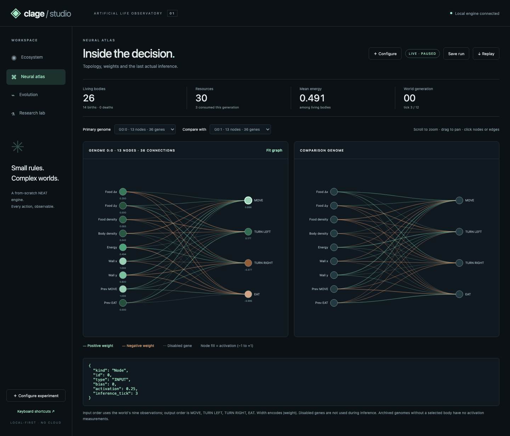
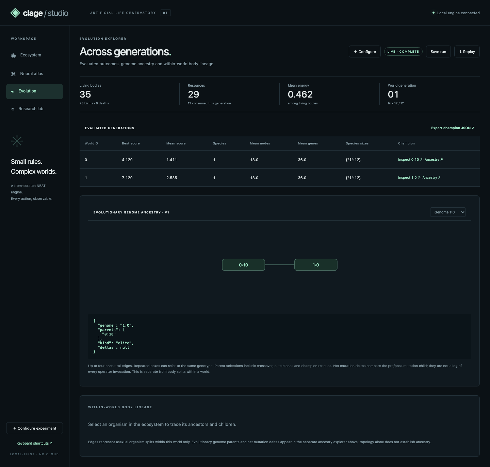
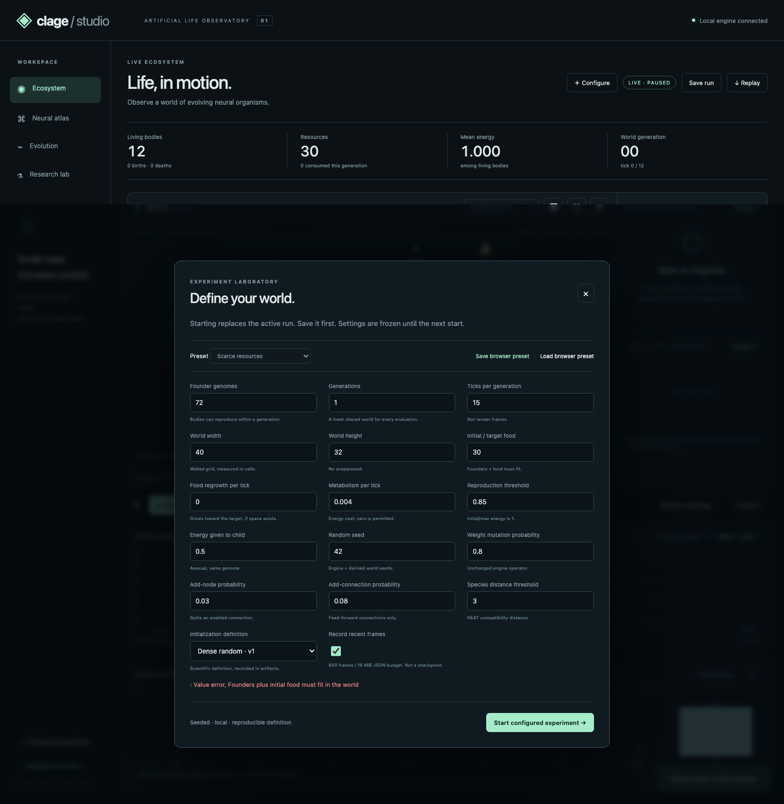
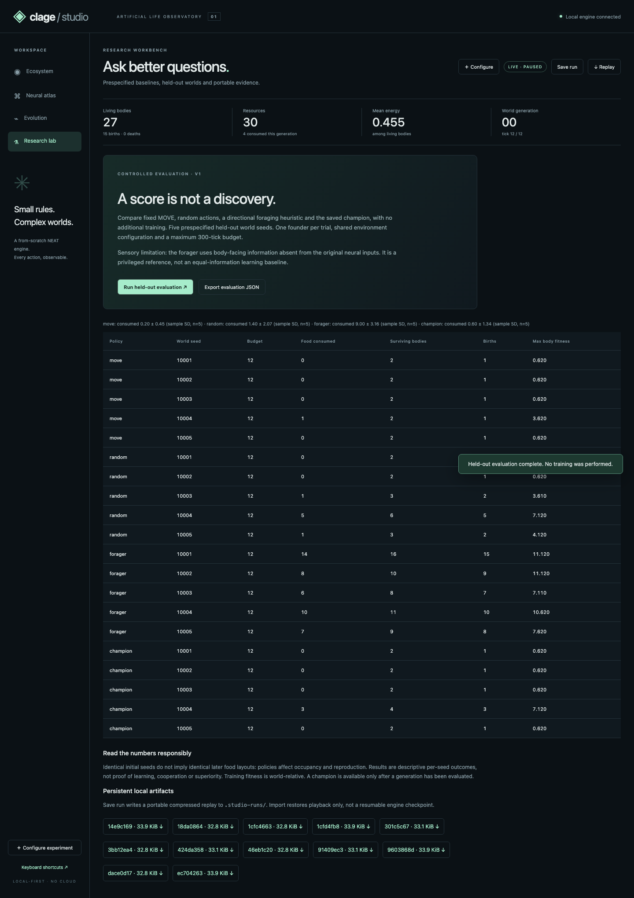

# Clage Studio guide

## Install and launch

From the repository root, install `.[studio]` (or `.[dev,studio]` for development),
then run `python -m studio`. Visit `http://127.0.0.1:8765`. Use `--port 8766` if
occupied. Stop with Ctrl-C. Python is authoritative; no Node service runs in
production. Optional dependencies do not replace the from-scratch engine.

## Two-minute demonstration

1. Resume the paused default world. Drag to pan, scroll to zoom, click a creature.
2. Follow the selected body; switch genome/species/energy/density/ancestry layers.
3. Open Neural atlas. Inspect a node and connection; compare a second genome.
   Recorded values are the actual last inference, identified by world tick.
4. Configure a short run: 12 founders, two generations, 12 ticks, 16×12 world,
   30 food, seed 42. Start; set 120 ticks/s. Settings replace the active run.
5. On completion, open Evolution and select a generation's champion/ancestry.
   Inspect parent provenance separately from organism births in the world.
6. Review recording, seek to another tick/generation, export JSON/gzip and import
   it. Load a second replay to compare at the latest recorded tick not after the
   primary tick in the same generation. No interpolation or future substitution.
7. Export metrics CSV, viewport/chart PNG or champion JSON. Research lab evaluates
   baselines and the saved champion on five unseen seed bases without training.

Keyboard: Space pause/resume, `.` step, `R` reset live run, `F` fit camera.
Shortcuts do not intercept form typing. Frame playback speed is distinct from
requested live ticks/s and measured render FPS. Reset reruns the frozen config.






## Recording and artifacts

Recordings are observations, **not checkpoints**. Saving retains a bounded recent
window, evaluated summaries/champions, frozen config, resolved settings, software
provenance and recorded evolutionary parents. Earlier missing frames are counted.
Imports validate references, positions, scores, metrics and neural outputs against
the archived topology. Consistency validation alone cannot establish that a file's
claimed historical inputs really occurred; deterministic rerunning provides the
stronger check below. Old `world.recorder` recordings use `python -m visual replay`.

```bash
python -m studio.reproduce path/to/replay.json.gz
python -m studio.evaluate path/to/replay.json.gz --out results/heldout.json
# A champion JSON exported by Studio also works with studio.evaluate.
# Output uses exclusive creation: choose a new filename rather than overwrite.
python -m studio.validate --out results/studio-validation.json
python -m studio.benchmark --out results/studio-benchmark.json --repeats 3
```

Reproduce starts from the initial seed/config, verifies retained observations and
does not resume an arbitrary frame. Matching across different engine commits is
not guaranteed: retain the recorded commit and dependencies. `studio.validate`
also reports process peak RSS using Unix `resource` (macOS/Linux utility).
Artifacts default to `.studio-runs/`, configurable with `CLAGE_ARTIFACTS`.
Presets live in browser local storage, not a cross-device account.

## API

The generated contract is at `/openapi.json`. Interactive CDN-based Swagger is
disabled so the core remains offline/self-contained. Same-origin frontend uses:

| Method/path | Contract |
|---|---|
| GET `/api/state` | Config, current frame, evaluated history, recording/status/clocks |
| POST `/api/runs` | Validated `RunConfig`; replaces active run and starts paused |
| POST `/api/control` | `action`: pause/resume/reset/step/speed; speed 1–120 |
| GET `/api/genomes` | Genotype topologies, evaluated fitness or null |
| GET `/api/lineage` | Evolutionary genome parents/kinds/net deltas |
| GET `/api/champion` | Best evaluated champion plus config/provenance; 409 if none |
| GET `/api/replay` | Portable bounded replay JSON; 409 if recording disabled |
| GET `/api/export` | Portable gzip replay attachment |
| POST `/api/replay/validate` | Raw JSON, at most 24 MiB; 422 invalid, 413 too large |
| GET/POST `/api/artifacts` | List local saves / atomically save current replay |
| GET `/api/artifacts/{id}` | Download a known 32-hex-ID artifact |
| POST `/api/evaluate` | Seeded policy trials; no training; one evaluation at a time |
| WS `/api/stream` | Changed JSON state ≤10 Hz; idle `{ "heartbeat": true }` |

```bash
curl http://127.0.0.1:8765/api/state
curl -X POST http://127.0.0.1:8765/api/runs \
  -H 'Content-Type: application/json' \
  -d '{"population":12,"generations":2,"ticks":12,"width":16,"height":12,"food":30,"seed":42}'
curl -X POST http://127.0.0.1:8765/api/control \
  -H 'Content-Type: application/json' -d '{"action":"resume"}'
```

Integer fields are strict; extra config fields/nonfinite values fail validation.
Founders + initial food must fit. Population ≤2,000; grid ≤128×128; generations
≤50; ticks ≤3,000; founders×generations ≤10,000. Interactive evaluation requires
≤4,096 cells; use offline evaluation for larger grids. A safety halt requires reset.
This loopback server is for trusted local use, not public deployment.

## Metric dictionary

| Display | Meaning / limitation |
|---|---|
| Living bodies | Alive organisms, including asexual offspring, not founder genomes |
| Births/deaths | Cumulative within current world; reset each generation |
| Consumed | Sum of actual consumption events across all bodies this world |
| Mean energy | Alive bodies only; zero for no living bodies |
| Last actions | Last chosen action of living bodies that have acted, not cumulative frequency |
| Body score | `3*food + .01*age + .5*offspring`, provisional until world ends |
| Genome fitness | Maximum body score for the genotype, not sum or average |
| Species | NEAT evaluated assignments; null/gray before assignment is available |
| Mean nodes/genes | Mean genotype topology sizes; genes include disabled connections |
| Density layers | Counts in a 5×5 neighborhood, saturate visually at 13 |
| Trails/events | Received-state changes, not complete trajectories or exact event timestamps |

Live graphs sample received snapshots ≤10 Hz; replay charts use retained frames.
Lines break at generation boundaries. Neural inputs precede the action; body
position/energy follow it. A dead body's last inference can precede the displayed
frame; read its recorded inference tick. No synthetic activation animation is used.

## Developer verification

```bash
python -m pip install -e ".[dev,studio]"
python -m pytest -o addopts='' -q
python -m ruff check .
python -m mypy neat world diversity experiments benchmarks visual studio
npm ci
npx playwright install chromium
npm test
npm run test:e2e
```

Playwright starts its own server on port 8876. Screenshots and renderer benchmark
are regenerated under `docs/studio/`; artifacts/test downloads are ignored.
Existing batch experiments/analytics/benchmark commands remain in the README.
Use world mutation methods rather than directly editing indexed cell/food tables.
See the remaining-work report before interpreting this as a complete research suite.
